# Design Document: Founder Governance

## Overview

Founder Governance adds five interconnected governance systems to PACE for founding teams (3–5 founders): biweekly anonymous peer review with equity consequences, a weekly performance leaderboard, a real-time equity dashboard with vesting/dilution tracking, four-tier data visibility controls, and a startup health dashboard with runway and balance indicators. It also removes five legacy features (mood check-ins, meeting logger, morning digest, standup prompt, monthly digest PDF).

This feature deliberately introduces comparative rankings and accountability consequences — a philosophical shift from v2's "no comparative rankings" policy. The shift is scoped exclusively to users with the `founder` role; non-founder team members are unaffected.

Key design decisions:
- **Role-based gating**: All governance features are gated on `user.role` containing "founder" (checked via a new `isFounder()` helper). The existing `AuthGuard` is extended with a `FounderGuard` wrapper for governance routes.
- **Existing infrastructure reuse**: Same SQLite → PocketBase sync pipeline, same Zustand + TanStack Query patterns, same Tauri IPC for Rust commands.
- **Seven new SQLite tables**: `review_cycles`, `founder_reviews`, `accountability_warnings`, `dilution_events`, `equity_stakes`, `decisions`, `startup_health_config`. All synced except `startup_health_config` (local settings).
- **Four new routes**: `/founder-review`, `/leaderboard`, `/equity`, `/startup-health` — grouped under a "Governance" sidebar section visible only to founders.
- **Legacy removal**: Delete 12+ source files, 6 property test files, 2 database tables, 1 route, and associated sidebar/UI references.

## Architecture

The governance layer plugs into the existing PACE architecture graph. No existing components are modified in breaking ways — governance is additive except for the legacy removals.

```mermaid
graph TD
    subgraph Desktop["PACE Desktop App (Tauri v2)"]
        subgraph Frontend["React 19 Frontend"]
            Router["TanStack Router (extended with governance routes)"]
            ExistingScreens["Existing Screens: Today, Team, Tasks, Review, Dashboard, etc."]
            GovScreens["Governance Screens: FounderReview, Leaderboard, Equity, StartupHealth"]
            FounderGuard["FounderGuard (role-based route protection)"]
            GovStores["Governance Stores: reviewStore, leaderboardStore, equityStore, healthStore"]
            ExistingStores["Existing Stores: session, task, team, leave, dashboard, analytics"]
            SyncService["Background Sync Service (extended with governance collections)"]
            RealtimeClient["PocketBase Realtime (extended subscriptions for equity, reviews)"]
            PDFExport["Investor Summary PDF Generator (jsPDF)"]
        end
        subgraph Backend["Rust Backend"]
            ExistingRust["Existing: Idle, Heartbeat, Power, Tray, Git, Attendance, Analytics"]
            PeerReviewCmd["compute_review_results() — average scores, lowest-ranked detection"]
            LeaderboardCmd["compute_founder_scores() — weekly composite scoring"]
            EquityCmd["apply_dilution() — equity redistribution after warnings"]
            HealthCmd["compute_startup_health() — runway, balance, decision velocity"]
        end
        SQLite["SQLite (existing tables + 7 governance tables)"]
    end

    subgraph Cloud["AWS Lightsail VPS"]
        PocketBase["PocketBase (extended with governance collections)"]
        ExistingHooks["Existing PB Hooks: AI tasks, reviews, smart-leave"]
        LiteLLM["LiteLLM Proxy"]
    end

    Router --> FounderGuard
    FounderGuard --> GovScreens
    Router --> ExistingScreens
    GovScreens --> GovStores
    GovStores --> SQLite
    SyncService --> PocketBase
    RealtimeClient --> PocketBase
    PeerReviewCmd --> SQLite
    LeaderboardCmd --> SQLite
    EquityCmd --> SQLite
    HealthCmd --> SQLite
    PDFExport --> SQLite
```



### Navigation Update

The sidebar extends with a "Governance" section visible only to founders. The "Monthly" item is removed (legacy). Existing v1 and Team Ops items remain unchanged.

```
── V1 ──
Today        /
Team         /team
Tasks        /tasks
Review       /review
── Team Ops ──
Dashboard    /dashboard
Attendance   /attendance
Leave        /leave
Requests     /requests
Analytics    /analytics
Digest       /digest
── Governance (founders only) ──
Founder Review   /founder-review
Leaderboard      /leaderboard
Equity           /equity
Startup Health   /startup-health
── ──
Settings     /settings
```

### Visibility Tier Enforcement

Four tiers are enforced at both the frontend (route guards, conditional rendering) and backend (Rust command validation, PocketBase API rules):

| Tier | Who Can See | Enforced By |
|---|---|---|
| Everyone | All authenticated users | `AuthGuard` (existing) |
| Founders_Only | Users with `founder` in role | `FounderGuard` (new) |
| Admin_Only | Users with `admin` in role | `AdminGuard` (new) |
| Individual_Only | Only the owning user | Local SQLite only, no sync |

The `FounderGuard` component wraps governance routes and checks `useAuthStore().user.role`:

```typescript
// src/components/FounderGuard.tsx
function FounderGuard({ children }: { children: React.ReactNode }) {
  const role = useAuthStore((s) => s.user?.role ?? "");
  const isFounder = role.toLowerCase().includes("founder") || role.toLowerCase().includes("ceo");
  
  if (!isFounder) {
    return <AccessDenied message="Founders only" />;
  }
  return <>{children}</>;
}
```

The `isFounder()` and `isAdmin()` utility functions are shared across frontend and Rust:

```typescript
// src/lib/roles.ts
export function isFounder(role: string | null): boolean {
  if (!role) return false;
  const lower = role.toLowerCase();
  return lower.includes("founder") || lower.includes("ceo");
}

export function isAdmin(role: string | null): boolean {
  if (!role) return false;
  return role.toLowerCase().includes("admin") || role.toLowerCase().includes("ceo");
}
```

### Legacy Feature Removal Plan

Files to delete and references to remove:

| Legacy Feature | Files to Delete | References to Remove |
|---|---|---|
| Mood Check-ins | `src/lib/mood.ts`, `src/lib/mood.test.ts`, `src/__tests__/properties/mood-dismissal-no-record.property.test.ts` | `MoodCheck` type, mood_checks DDL, mood prompts in `StartSessionFlow`/`EndDayFlow`, `IdleModal` mood option |
| Meeting Logger | `src/lib/meetings.ts`, `src/lib/meetings.test.ts`, `src/__tests__/properties/meeting-record-linkage.property.test.ts` | `Meeting` type, meetings DDL, "Meeting" option in `IdleModal`, meeting entries in EOD report |
| Morning Digest | Morning digest logic in `src/lib/monthlyDigest.ts` | `MorningDigest` type, `DigestScheduler` references, `src/__tests__/properties/morning-digest-content.property.test.ts` |
| Standup Prompt | `src/lib/standup.ts`, `src/lib/standup.test.ts`, `src/__tests__/properties/standup-once-per-day.property.test.ts` | `StandupResponse` type, standup_responses DDL, standup prompt in session start flow |
| Monthly Digest PDF | `src/screens/Monthly/index.tsx`, `src/__tests__/properties/monthly-digest-content.property.test.ts` | `/monthly` route, "Monthly" sidebar item, `MonthlyScreen` import in router |

Database tables to drop in migration rollback: `mood_checks`, `meetings`, `standup_responses`. The `morning_digests` table is also dropped.

PocketBase collections to delete: `standup_responses`, `meetings`, `morning_digests`.


## Components and Interfaces

### Component 1: Peer Review Engine (Rust + Frontend)

**Purpose**: Manages biweekly review cycles — creation, submission, scoring, accountability warnings, and dilution triggers.

```rust
#[derive(Debug, Clone, Serialize, Deserialize)]
pub struct ReviewCycle {
    pub id: String,
    pub start_date: i64,           // UTC timestamp
    pub end_date: i64,             // UTC timestamp (start_date + 14 days)
    pub submission_deadline: i64,  // UTC timestamp (start_date + 48 hours)
    pub status: String,            // "open" | "closed" | "resolved"
    pub resolved_at: Option<i64>,
}

#[derive(Debug, Clone, Serialize, Deserialize)]
pub struct FounderReview {
    pub id: String,
    pub cycle_id: String,
    pub reviewer_id: String,
    pub reviewee_id: String,
    pub output_score: i32,         // 1-5
    pub reliability_score: i32,    // 1-5
    pub initiative_score: i32,     // 1-5
    pub submitted_at: i64,
}

#[derive(Debug, Clone, Serialize, Deserialize)]
pub struct AccountabilityWarning {
    pub id: String,
    pub founder_id: String,
    pub cycle_id: String,
    pub issued_at: i64,
    pub acknowledged: bool,
}

#[derive(Debug, Clone, Serialize, Deserialize)]
pub struct ReviewResult {
    pub founder_id: String,
    pub output_avg: f64,
    pub reliability_avg: f64,
    pub initiative_avg: f64,
    pub overall_avg: f64,
}

#[tauri::command]
pub fn create_review_cycle(start_date: i64) -> Result<ReviewCycle, String>;

#[tauri::command]
pub fn submit_founder_review(
    cycle_id: String,
    reviewer_id: String,
    reviewee_id: String,
    output_score: i32,
    reliability_score: i32,
    initiative_score: i32,
) -> Result<FounderReview, String>;

#[tauri::command]
pub fn close_review_cycle(cycle_id: String) -> Result<Vec<ReviewResult>, String>;

#[tauri::command]
pub fn resolve_tie(
    cycle_id: String,
    ceo_user_id: String,
    selected_founder_id: String,
) -> Result<(), String>;

#[tauri::command]
pub fn get_review_history(founder_id: String) -> Result<Vec<ReviewCycle>, String>;

#[tauri::command]
pub fn get_warning_count(founder_id: String) -> Result<i32, String>;
```

**Algorithm — Review Cycle Scoring** (Req 1.7, 2.1):

```
function compute_review_results(cycle_id) -> Vec<ReviewResult>:
    // Preconditions: cycle status is "closed" (submission window ended)
    
    reviews = SELECT * FROM founder_reviews WHERE cycleId = cycle_id
    
    // Group reviews by reviewee
    by_reviewee = group_by(reviews, r => r.revieweeId)
    
    results = []
    for each (founder_id, founder_reviews) in by_reviewee:
        output_avg = mean(r.outputScore for r in founder_reviews)
        reliability_avg = mean(r.reliabilityScore for r in founder_reviews)
        initiative_avg = mean(r.initiativeScore for r in founder_reviews)
        overall_avg = (output_avg + reliability_avg + initiative_avg) / 3.0
        
        results.push(ReviewResult {
            founder_id,
            output_avg,
            reliability_avg,
            initiative_avg,
            overall_avg,
        })
    
    return results sorted by overall_avg ascending
    
    // Postconditions:
    //   Each score average is in [1.0, 5.0]
    //   overall_avg = (output_avg + reliability_avg + initiative_avg) / 3.0
    //   Results are sorted ascending (lowest first for accountability)
```

**Algorithm — Lowest-Ranked Detection and Accountability** (Req 2.1–2.5):

```
function resolve_review_cycle(cycle_id, ceo_user_id) -> AccountabilityWarning:
    // Preconditions: cycle status is "closed"
    
    results = compute_review_results(cycle_id)
    lowest_score = results[0].overall_avg
    
    // Find all founders tied at the lowest score
    tied = results.filter(r => r.overall_avg == lowest_score)
    
    if tied.length == 1:
        lowest_founder = tied[0].founder_id
    else:
        // Tie-breaking: check for CEO vote (Req 2.2)
        ceo_vote = SELECT * FROM tie_break_votes
                   WHERE cycleId = cycle_id AND ceoUserId = ceo_user_id
        
        if ceo_vote exists:
            lowest_founder = ceo_vote.selectedFounderId
        else:
            // Fallback: founder with fewer hours in review period (Req 2.3)
            lowest_founder = tied.min_by(f =>
                SELECT SUM(total_hours) FROM attendance
                WHERE userId = f.founder_id
                AND date BETWEEN cycle.start_date AND cycle.end_date
            ).founder_id
    
    // Issue accountability warning (Req 2.4)
    warning = INSERT INTO accountability_warnings
              (id, founderId, cycleId, issuedAt, acknowledged)
              VALUES (uuid(), lowest_founder, cycle_id, now(), false)
    
    // Check for consecutive warnings → dilution (Req 2.5)
    prev_cycle = SELECT * FROM review_cycles
                 WHERE endDate < cycle.startDate
                 ORDER BY endDate DESC LIMIT 1
    
    if prev_cycle exists:
        prev_warning = SELECT * FROM accountability_warnings
                       WHERE founderId = lowest_founder
                       AND cycleId = prev_cycle.id
        
        if prev_warning exists:
            // Two consecutive warnings → trigger 1% dilution
            trigger_dilution(lowest_founder, cycle_id, 1.0)
    
    // Update cycle status
    UPDATE review_cycles SET status = 'resolved', resolvedAt = now()
    WHERE id = cycle_id
    
    return warning
```

### Component 2: Founder Leaderboard Engine (TypeScript)

**Purpose**: Computes weekly composite scores from hours, tasks, and peer review data. Pure functions — no side effects.

```typescript
// src/lib/leaderboard.ts

export interface FounderScore {
  founderId: string;
  name: string;
  hours: number;
  tasksCompleted: number;
  peerReviewAvg: number;
  normalizedHours: number;      // 0.0 - 1.0
  normalizedTasks: number;      // 0.0 - 1.0
  normalizedPeerReview: number; // 0.0 - 1.0
  compositeScore: number;       // weighted combination
  isFounderOfWeek: boolean;
}

export function computeFounderScores(
  founders: Array<{ id: string; name: string }>,
  weeklyHours: Map<string, number>,
  weeklyTasks: Map<string, number>,
  peerReviewAvgs: Map<string, number>,  // from most recent cycle, or null
): FounderScore[];

export function determineFounderOfWeek(scores: FounderScore[]): string; // founderId
```

**Algorithm — Leaderboard Score Computation** (Req 4.1–4.6):

```
function computeFounderScores(founders, weeklyHours, weeklyTasks, peerReviewAvgs):
    // Preconditions: founders.length >= 1
    
    maxHours = max(weeklyHours.values()) or 0
    maxTasks = max(weeklyTasks.values()) or 0
    
    scores = []
    for each founder in founders:
        hours = weeklyHours.get(founder.id) or 0
        tasks = weeklyTasks.get(founder.id) or 0
        peerAvg = peerReviewAvgs.get(founder.id) or 3.0  // default 3.0/5.0 (Req 4.5)
        
        // Normalize (Req 4.2, 4.3, 4.4)
        normHours = if maxHours > 0: hours / maxHours else: 0.0    // Req 4.6
        normTasks = if maxTasks > 0: tasks / maxTasks else: 0.0    // Req 4.6
        normPeer  = peerAvg / 5.0
        
        // Weighted composite (Req 4.1)
        composite = (normHours * 0.3) + (normTasks * 0.4) + (normPeer * 0.3)
        
        scores.push(FounderScore {
            founderId: founder.id,
            name: founder.name,
            hours, tasksCompleted: tasks, peerReviewAvg: peerAvg,
            normalizedHours: normHours,
            normalizedTasks: normTasks,
            normalizedPeerReview: normPeer,
            compositeScore: composite,
            isFounderOfWeek: false,
        })
    
    // Sort descending by composite score (Req 5.1)
    scores.sort_by(s => -s.compositeScore)
    
    // Founder of the Week: highest score, tie-break by tasks (Req 5.3, 5.4)
    topScore = scores[0].compositeScore
    tied = scores.filter(s => s.compositeScore == topScore)
    winner = if tied.length == 1: tied[0]
             else: tied.max_by(s => s.tasksCompleted)
    winner.isFounderOfWeek = true
    
    return scores
    
    // Postconditions:
    //   All normalized values in [0.0, 1.0]
    //   compositeScore in [0.0, 1.0]
    //   Exactly one founder has isFounderOfWeek = true
    //   Scores sorted descending
```

### Component 3: Equity Dashboard Engine (TypeScript + Rust)

**Purpose**: Tracks equity stakes, computes vesting progress, handles dilution events, and generates cap table data.

```typescript
// src/lib/equity.ts

export interface EquityStake {
  id: string;
  founderId: string;
  initialStakePct: number;
  currentStakePct: number;
  vestingStartDate: number;      // UTC timestamp
  cliffDate: number;             // UTC timestamp
  vestingEndDate: number;        // UTC timestamp
  vestingScheduleMonths: number; // typically 48
  updatedAt: number;
}

export interface DilutionEvent {
  id: string;
  founderId: string;
  cycleId: string;
  dilutionPct: number;           // 1.0
  previousStakePct: number;
  newStakePct: number;
  redistributionDetails: Record<string, { previous: number; new: number }>;
  createdAt: number;
}

export type CliffStatus =
  | { status: "pre_cliff"; daysRemaining: number }
  | { status: "cliff_passed"; cliffDate: number }
  | { status: "fully_vested" };

export function computeVestingProgress(stake: EquityStake, now: number): number; // 0.0 - 1.0
export function computeCliffStatus(stake: EquityStake, now: number): CliffStatus;
export function applyDilution(
  stakes: EquityStake[],
  targetFounderId: string,
  dilutionPct: number,
): { updatedStakes: EquityStake[]; event: DilutionEvent };
export function computeProjectedPayout(stakePct: number, valuation: number): number;
export function validateCapTableSum(stakes: EquityStake[]): boolean; // within 0.01% of 100
```

**Algorithm — Equity Dilution** (Req 6.5, 7.2):

```
function applyDilution(stakes, targetFounderId, dilutionPct):
    // Preconditions:
    //   stakes.sum(s.currentStakePct) ≈ 100.0 (within 0.01%)
    //   dilutionPct > 0 (typically 1.0)
    //   targetFounderId exists in stakes
    
    target = stakes.find(s => s.founderId == targetFounderId)
    previousPct = target.currentStakePct
    newPct = previousPct - dilutionPct
    
    // Redistribute diluted amount proportionally among remaining founders (Req 6.5)
    others = stakes.filter(s => s.founderId != targetFounderId)
    othersTotal = others.sum(s => s.currentStakePct)
    
    redistributionDetails = {}
    for each other in others:
        share = (other.currentStakePct / othersTotal) * dilutionPct
        redistributionDetails[other.founderId] = {
            previous: other.currentStakePct,
            new: other.currentStakePct + share,
        }
        other.currentStakePct += share
    
    target.currentStakePct = newPct
    redistributionDetails[targetFounderId] = { previous: previousPct, new: newPct }
    
    event = DilutionEvent {
        id: uuid(),
        founderId: targetFounderId,
        cycleId: current_cycle_id,
        dilutionPct,
        previousStakePct: previousPct,
        newStakePct: newPct,
        redistributionDetails,
        createdAt: now(),
    }
    
    return { updatedStakes: stakes, event }
    
    // Postconditions:
    //   stakes.sum(s.currentStakePct) ≈ 100.0 (within 0.01%)
    //   target.currentStakePct == previousPct - dilutionPct
    //   Each other founder's increase is proportional to their share of remaining equity
```

**Algorithm — Vesting Progress** (Req 6.2, 6.3):

```
function computeVestingProgress(stake, now):
    if now < stake.vestingStartDate:
        return 0.0
    if now >= stake.vestingEndDate:
        return 1.0
    
    totalDuration = stake.vestingEndDate - stake.vestingStartDate
    elapsed = now - stake.vestingStartDate
    return elapsed / totalDuration
    
    // Postconditions: result in [0.0, 1.0]

function computeCliffStatus(stake, now):
    if now < stake.cliffDate:
        daysRemaining = (stake.cliffDate - now) / 86400
        return { status: "pre_cliff", daysRemaining: ceil(daysRemaining) }
    if now >= stake.vestingEndDate:
        return { status: "fully_vested" }
    return { status: "cliff_passed", cliffDate: stake.cliffDate }
```

### Component 4: Startup Health Engine (TypeScript)

**Purpose**: Computes runway, founder balance, decision velocity, and burn rate alignment.

```typescript
// src/lib/startupHealth.ts

export interface StartupHealthData {
  runwayMonths: number;
  runwayStatus: "normal" | "amber" | "red";
  founderBalance: {
    stdDev: number;
    founders: Array<{
      founderId: string;
      name: string;
      weeklyHours: number;
      deviationPct: number;
      hasAlert: boolean;
    }>;
    teamAvgHours: number;
  };
  decisionVelocity: number;     // days, 1 decimal
  burnRateAlignment: number;    // percentage
  burnRateStatus: "normal" | "amber" | "red";
}

export interface StartupHealthConfig {
  cashBalance: number;
  monthlyExpenses: number[];     // last 3 months
  plannedMonthlyBudget: number;
}

export interface Decision {
  id: string;
  title: string;
  description: string;
  createdAt: number;             // UTC timestamp
  resolvedAt: number | null;     // UTC timestamp, null if open
}

export function computeRunway(config: StartupHealthConfig): { months: number; status: "normal" | "amber" | "red" };
export function computeFounderBalance(
  founderHours: Map<string, number>,
  founderNames: Map<string, string>,
): StartupHealthData["founderBalance"];
export function computeDecisionVelocity(decisions: Decision[], windowDays?: number): number;
export function computeBurnRateAlignment(
  actualSpend: number,
  plannedBudget: number,
): { pct: number; status: "normal" | "amber" | "red" };
```

**Algorithm — Runway Computation** (Req 12.1–12.4):

```
function computeRunway(config):
    // Preconditions: config.monthlyExpenses has 1-3 entries
    
    if config.monthlyExpenses.length == 0 or all expenses are 0:
        return { months: Infinity, status: "normal" }
    
    avgBurn = mean(config.monthlyExpenses)
    months = config.cashBalance / avgBurn
    
    status = if months < 3: "red"          // Req 12.4
             else if months < 6: "amber"   // Req 12.3
             else: "normal"
    
    return { months: round(months, 1), status }
    
    // Postconditions:
    //   months >= 0
    //   status reflects threshold correctly
```

**Algorithm — Founder Balance Detection** (Req 13.1–13.4):

```
function computeFounderBalance(founderHours, founderNames):
    hours = Array.from(founderHours.values())
    
    if hours.length < 2:
        return { stdDev: 0, founders: [...], teamAvgHours: hours[0] or 0 }
    
    teamAvg = mean(hours)
    stdDev = standardDeviation(hours)
    
    founders = []
    for each (founderId, weeklyHours) in founderHours:
        deviationPct = if teamAvg > 0:
            abs(weeklyHours - teamAvg) / teamAvg * 100
        else: 0
        
        hasAlert = deviationPct > 30  // Req 13.2: >30% deviation triggers alert
        
        founders.push({
            founderId,
            name: founderNames.get(founderId),
            weeklyHours,
            deviationPct,
            hasAlert,
        })
    
    return { stdDev, founders, teamAvgHours: teamAvg }
    
    // Postconditions:
    //   hasAlert == true iff deviationPct > 30
    //   stdDev >= 0
```

**Algorithm — Decision Velocity** (Req 14.1):

```
function computeDecisionVelocity(decisions, windowDays = 30):
    cutoff = now() - windowDays * 86400
    
    resolved = decisions.filter(d =>
        d.resolvedAt != null AND d.resolvedAt >= cutoff
    )
    
    if resolved.length == 0:
        return 0.0
    
    totalDays = resolved.sum(d => (d.resolvedAt - d.createdAt) / 86400)
    return round(totalDays / resolved.length, 1)
    
    // Postconditions: result >= 0
```


### Component 5: Visibility Controller (Frontend + Rust)

**Purpose**: Enforces four-tier data access across all screens and API endpoints.

```typescript
// src/lib/roles.ts

export type VisibilityTier = "everyone" | "founders_only" | "admin_only" | "individual_only";

export function isFounder(role: string | null): boolean {
  if (!role) return false;
  const lower = role.toLowerCase();
  return lower.includes("founder") || lower.includes("ceo");
}

export function isAdmin(role: string | null): boolean {
  if (!role) return false;
  const lower = role.toLowerCase();
  return lower.includes("admin") || lower.includes("ceo");
}

export function canAccess(userRole: string | null, tier: VisibilityTier, userId?: string, ownerId?: string): boolean {
  switch (tier) {
    case "everyone": return true;
    case "founders_only": return isFounder(userRole);
    case "admin_only": return isAdmin(userRole);
    case "individual_only": return userId === ownerId;
  }
}
```

```typescript
// src/components/FounderGuard.tsx
import { useAuthStore } from "@/stores/authStore";
import { isFounder } from "@/lib/roles";

export default function FounderGuard({ children }: { children: React.ReactNode }) {
  const role = useAuthStore((s) => s.user?.role ?? "");
  if (!isFounder(role)) {
    return (
      <div className="flex h-full items-center justify-center text-muted-foreground">
        <p className="text-sm">Founders only</p>
      </div>
    );
  }
  return <>{children}</>;
}
```

### Component 6: Governance Zustand Stores (Frontend)

**Purpose**: State management for the four governance screens.

```typescript
// src/stores/reviewStore.ts
interface ReviewState {
  currentCycle: ReviewCycle | null;
  results: ReviewResult[];
  history: ReviewCycle[];
  warnings: Record<string, number>;  // founderId → warning count
  loading: boolean;
  refresh: () => Promise<void>;
  submitReview: (revieweeId: string, output: number, reliability: number, initiative: number) => Promise<void>;
}

// src/stores/leaderboardStore.ts
interface LeaderboardState {
  scores: FounderScore[];
  currentWeek: string;  // YYYY-MM-DD (Monday)
  loading: boolean;
  refresh: () => Promise<void>;
}

// src/stores/equityStore.ts
interface EquityState {
  stakes: EquityStake[];
  dilutionHistory: DilutionEvent[];
  loading: boolean;
  refresh: () => Promise<void>;
}

// src/stores/healthStore.ts
interface HealthState {
  data: StartupHealthData | null;
  config: StartupHealthConfig | null;
  decisions: Decision[];
  loading: boolean;
  refresh: () => Promise<void>;
  updateConfig: (config: StartupHealthConfig) => Promise<void>;
  logDecision: (title: string, description: string) => Promise<void>;
  resolveDecision: (decisionId: string) => Promise<void>;
}
```

### Component 7: Investor Summary PDF Generator (Frontend)

**Purpose**: Generates a branded PDF with startup health metrics for investor sharing.

```typescript
// src/lib/investorPdf.ts
import jsPDF from "jspdf";

export interface InvestorSummaryData {
  dateRange: { start: number; end: number };
  runwayMonths: number;
  burnRateAlignment: number;
  founderHoursSummary: Array<{ name: string; hours: number }>;
  decisionVelocity: number;
  taskCompletionVelocity: number;  // tasks/week
  teamSize: number;
}

export async function generateInvestorPdf(data: InvestorSummaryData): Promise<void>;
// Uses Tauri save dialog for file location (Req 15.4)
```

### Component 8: Review Cycle Scheduler (Frontend)

**Purpose**: Background timer that checks if a new review cycle should be created every 14 days.

```typescript
// src/lib/reviewScheduler.ts

export function shouldCreateNewCycle(
  lastCycleStartDate: number | null,
  featureEnabledDate: number,
  now: number,
): boolean;
// Returns true if 14+ days have passed since last cycle start (or feature enable date)

export function getSubmissionDeadline(cycleStartDate: number): number;
// Returns cycleStartDate + 48 * 3600 (48 hours)

export function isCycleExpired(cycle: ReviewCycle, now: number): boolean;
// Returns true if now > cycle.submissionDeadline and cycle.status === "open"
```

## Data Models

### v3 SQLite Schema Extension (Governance)

All new tables are added via a new migration `v3_founder_governance_schema.js`. Existing v1 and v2 tables remain unchanged (except for dropping legacy tables).

### ReviewCycle

```typescript
interface ReviewCycle {
  id: string;
  startDate: number;             // UTC timestamp
  endDate: number;               // UTC timestamp (startDate + 14 days)
  submissionDeadline: number;    // UTC timestamp (startDate + 48 hours)
  status: "open" | "closed" | "resolved";
  resolvedAt: number | null;
  createdAt: number;
}
```

**SQLite DDL**:
```sql
CREATE TABLE IF NOT EXISTS review_cycles (
    id TEXT PRIMARY KEY,
    startDate INTEGER NOT NULL,
    endDate INTEGER NOT NULL,
    submissionDeadline INTEGER NOT NULL,
    status TEXT NOT NULL CHECK(status IN ('open', 'closed', 'resolved')),
    resolvedAt INTEGER,
    createdAt INTEGER NOT NULL,
    CHECK(endDate > startDate),
    CHECK(submissionDeadline > startDate),
    CHECK(submissionDeadline <= endDate)
);
CREATE INDEX IF NOT EXISTS idx_review_cycles_status ON review_cycles(status);
```

### FounderReview

```typescript
interface FounderReview {
  id: string;
  cycleId: string;               // FK → review_cycles
  reviewerId: string;            // FK → users
  revieweeId: string;            // FK → users
  outputScore: number;           // 1-5
  reliabilityScore: number;      // 1-5
  initiativeScore: number;       // 1-5
  submittedAt: number;           // UTC timestamp
}
```

**Validation Rules**:
- `reviewerId` must differ from `revieweeId` (no self-review)
- Each (cycleId, reviewerId, revieweeId) combination must be unique
- Scores must be integers in [1, 5]
- Submission only allowed when cycle status is "open" and now < submissionDeadline

**SQLite DDL**:
```sql
CREATE TABLE IF NOT EXISTS founder_reviews (
    id TEXT PRIMARY KEY,
    cycleId TEXT NOT NULL REFERENCES review_cycles(id),
    reviewerId TEXT NOT NULL REFERENCES users(id),
    revieweeId TEXT NOT NULL REFERENCES users(id),
    outputScore INTEGER NOT NULL CHECK(outputScore >= 1 AND outputScore <= 5),
    reliabilityScore INTEGER NOT NULL CHECK(reliabilityScore >= 1 AND reliabilityScore <= 5),
    initiativeScore INTEGER NOT NULL CHECK(initiativeScore >= 1 AND initiativeScore <= 5),
    submittedAt INTEGER NOT NULL,
    CHECK(reviewerId != revieweeId),
    UNIQUE(cycleId, reviewerId, revieweeId)
);
CREATE INDEX IF NOT EXISTS idx_founder_reviews_cycle ON founder_reviews(cycleId);
CREATE INDEX IF NOT EXISTS idx_founder_reviews_reviewee ON founder_reviews(revieweeId);
```

### AccountabilityWarning

```typescript
interface AccountabilityWarning {
  id: string;
  founderId: string;             // FK → users
  cycleId: string;               // FK → review_cycles
  issuedAt: number;              // UTC timestamp
  acknowledged: boolean;
}
```

**SQLite DDL**:
```sql
CREATE TABLE IF NOT EXISTS accountability_warnings (
    id TEXT PRIMARY KEY,
    founderId TEXT NOT NULL REFERENCES users(id),
    cycleId TEXT NOT NULL REFERENCES review_cycles(id),
    issuedAt INTEGER NOT NULL,
    acknowledged INTEGER NOT NULL DEFAULT 0,
    UNIQUE(founderId, cycleId)
);
CREATE INDEX IF NOT EXISTS idx_warnings_founder ON accountability_warnings(founderId);
```

### EquityStake

```typescript
interface EquityStake {
  id: string;
  founderId: string;             // FK → users
  initialStakePct: number;       // e.g. 25.0
  currentStakePct: number;       // e.g. 24.0 after dilution
  vestingStartDate: number;      // UTC timestamp
  cliffDate: number;             // UTC timestamp
  vestingEndDate: number;        // UTC timestamp
  vestingScheduleMonths: number; // e.g. 48
  updatedAt: number;
}
```

**Validation Rules**:
- `currentStakePct` must be >= 0
- `vestingStartDate` < `cliffDate` < `vestingEndDate`
- Sum of all `currentStakePct` across founders must be ≈ 100.0 (within 0.01%)

**SQLite DDL**:
```sql
CREATE TABLE IF NOT EXISTS equity_stakes (
    id TEXT PRIMARY KEY,
    founderId TEXT NOT NULL REFERENCES users(id),
    initialStakePct REAL NOT NULL CHECK(initialStakePct >= 0),
    currentStakePct REAL NOT NULL CHECK(currentStakePct >= 0),
    vestingStartDate INTEGER NOT NULL,
    cliffDate INTEGER NOT NULL,
    vestingEndDate INTEGER NOT NULL,
    vestingScheduleMonths INTEGER NOT NULL,
    updatedAt INTEGER NOT NULL,
    CHECK(vestingStartDate < cliffDate),
    CHECK(cliffDate < vestingEndDate),
    UNIQUE(founderId)
);
```

### DilutionEvent

```typescript
interface DilutionEvent {
  id: string;
  founderId: string;             // FK → users
  cycleId: string;               // FK → review_cycles
  dilutionPct: number;           // 1.0
  previousStakePct: number;
  newStakePct: number;
  redistributionDetails: string; // JSON
  createdAt: number;
}
```

**SQLite DDL**:
```sql
CREATE TABLE IF NOT EXISTS dilution_events (
    id TEXT PRIMARY KEY,
    founderId TEXT NOT NULL REFERENCES users(id),
    cycleId TEXT NOT NULL REFERENCES review_cycles(id),
    dilutionPct REAL NOT NULL CHECK(dilutionPct > 0),
    previousStakePct REAL NOT NULL,
    newStakePct REAL NOT NULL,
    redistributionDetails TEXT NOT NULL,
    createdAt INTEGER NOT NULL
);
CREATE INDEX IF NOT EXISTS idx_dilution_founder ON dilution_events(founderId);
```

### Decision

```typescript
interface Decision {
  id: string;
  title: string;
  description: string;
  createdAt: number;             // UTC timestamp
  resolvedAt: number | null;     // UTC timestamp
}
```

**SQLite DDL**:
```sql
CREATE TABLE IF NOT EXISTS decisions (
    id TEXT PRIMARY KEY,
    title TEXT NOT NULL,
    description TEXT NOT NULL DEFAULT '',
    createdAt INTEGER NOT NULL,
    resolvedAt INTEGER
);
CREATE INDEX IF NOT EXISTS idx_decisions_resolved ON decisions(resolvedAt);
```

### StartupHealthConfig (local-only, never synced)

```typescript
interface StartupHealthConfig {
  id: string;
  cashBalance: number;
  monthlyExpenses: string;       // JSON array of last 3 months
  plannedMonthlyBudget: number;
  updatedAt: number;
}
```

**SQLite DDL**:
```sql
CREATE TABLE IF NOT EXISTS startup_health_config (
    id TEXT PRIMARY KEY,
    cashBalance REAL NOT NULL DEFAULT 0,
    monthlyExpenses TEXT NOT NULL DEFAULT '[]',
    plannedMonthlyBudget REAL NOT NULL DEFAULT 0,
    updatedAt INTEGER NOT NULL
);
```

### Sync Scope (Governance)

| Table | Synced to PocketBase? | Reason |
|---|---|---|
| review_cycles | ✅ Yes | All founders need consistent cycle state |
| founder_reviews | ✅ Yes | Aggregated results visible to all founders |
| accountability_warnings | ✅ Yes | Warning counts visible to all founders |
| dilution_events | ✅ Yes | Equity changes visible to all founders |
| equity_stakes | ✅ Yes | Cap table visible to all founders |
| decisions | ✅ Yes | Decision velocity computed across team |
| startup_health_config | ❌ No | Local financial settings, entered per-device |

### Legacy Tables to Drop

The v3 migration also drops these tables and their PocketBase collections:

```sql
DROP TABLE IF EXISTS mood_checks;
DROP TABLE IF EXISTS meetings;
DROP TABLE IF EXISTS standup_responses;
DROP TABLE IF EXISTS morning_digests;
```


## Correctness Properties

*A property is a characteristic or behavior that should hold true across all valid executions of a system — essentially, a formal statement about what the system should do. Properties serve as the bridge between human-readable specifications and machine-verifiable correctness guarantees.*

### Property 1: Review cycle scheduling

*For any* feature enable date and current timestamp, a new review cycle should be created if and only if 14 or more calendar days have elapsed since the last cycle's start date (or the feature enable date if no cycles exist). The new cycle's endDate should equal startDate + 14 days, and submissionDeadline should equal startDate + 48 hours.

**Validates: Requirements 1.1, 1.6**

### Property 2: Review submission validation

*For any* review submission attempt, the submission should be accepted if and only if: (a) the cycle status is "open", (b) the current time is before the submission deadline, (c) the reviewerId differs from the revieweeId, (d) no prior submission exists for the same (cycleId, reviewerId, revieweeId) triple, and (e) all three scores are integers in [1, 5]. Submissions violating any condition should be rejected.

**Validates: Requirements 1.3, 1.4, 1.6**

### Property 3: Review score averaging

*For any* set of founder reviews within a completed cycle, the computed average score per founder per dimension should equal the arithmetic mean of all submitted scores for that founder in that dimension, and the overall average should equal (output_avg + reliability_avg + initiative_avg) / 3.0.

**Validates: Requirements 1.7, 2.1**

### Property 4: Lowest-ranked identification and accountability warning

*For any* resolved review cycle, exactly one accountability warning should be issued to the founder with the lowest overall average score. When multiple founders tie for the lowest score and no CEO tie-break vote exists, the warning should go to the tied founder with the fewest total hours logged during the review period.

**Validates: Requirements 2.1, 2.3, 2.4**

### Property 5: Consecutive warnings trigger dilution

*For any* founder who receives accountability warnings in two consecutive review cycles (cycles with adjacent endDate/startDate), a dilution event of exactly 1% should be triggered. If the warnings are not in consecutive cycles, no dilution event should be triggered.

**Validates: Requirements 2.5**

### Property 6: Leaderboard score computation and ranking

*For any* set of founders with weekly hours, task counts, and peer review averages, the composite score should equal (normalizedHours × 0.3) + (normalizedTasks × 0.4) + (normalizedPeerReview × 0.3), where normalizedHours = hours / maxHours (or 0.0 if maxHours is 0), normalizedTasks = tasks / maxTasks (or 0.0 if maxTasks is 0), and normalizedPeerReview = peerAvg / 5.0 (defaulting to 3.0/5.0 = 0.6 when no review data exists). The output should be sorted by composite score descending, and exactly one founder should be marked as Founder of the Week — the one with the highest score, with ties broken by higher task count.

**Validates: Requirements 4.1, 4.2, 4.3, 4.4, 4.5, 4.6, 5.1, 5.3, 5.4**

### Property 7: Equity dilution preserves cap table sum

*For any* set of equity stakes summing to 100% and any dilution event reducing one founder's stake by a given percentage, after applying the dilution with proportional redistribution among remaining founders, the sum of all stakes should remain within 0.01% of 100%, the target founder's stake should decrease by exactly the dilution percentage, and each other founder's increase should be proportional to their share of the remaining equity.

**Validates: Requirements 6.5, 21.4**

### Property 8: Vesting progress and cliff status

*For any* equity stake and current timestamp, the vesting progress should equal max(0, min(1, (now - vestingStartDate) / (vestingEndDate - vestingStartDate))). The cliff status should be "pre_cliff" with correct daysRemaining when now < cliffDate, "cliff_passed" when cliffDate ≤ now < vestingEndDate, and "fully_vested" when now ≥ vestingEndDate.

**Validates: Requirements 6.2, 6.3**

### Property 9: Projected payout computation

*For any* equity stake percentage and hypothetical company valuation (both non-negative), the projected payout should equal valuation × currentStakePct / 100.

**Validates: Requirements 7.3**

### Property 10: Visibility tier access control

*For any* user role and visibility tier combination, access should be granted if and only if: (a) tier is "everyone" — all authenticated users pass, (b) tier is "founders_only" — only users whose role contains "founder" or "ceo" pass, (c) tier is "admin_only" — only users whose role contains "admin" or "ceo" pass, (d) tier is "individual_only" — only the owning user passes.

**Validates: Requirements 8.2, 9.2, 10.2, 11.2**

### Property 11: Runway computation and thresholds

*For any* cash balance and array of 1–3 monthly expense values, the runway in months should equal cashBalance / mean(monthlyExpenses). The status should be "red" when runway < 3, "amber" when 3 ≤ runway < 6, and "normal" when runway ≥ 6. When all expenses are 0, runway should be treated as infinite (or a very large number) with "normal" status.

**Validates: Requirements 12.1, 12.3, 12.4**

### Property 12: Founder balance detection

*For any* set of founder weekly hours (2+ founders), the standard deviation should match the population standard deviation formula. A founder should have a balance alert if and only if their absolute deviation from the team average exceeds 30% of the team average.

**Validates: Requirements 13.1, 13.2**

### Property 13: Decision velocity computation

*For any* set of decisions with createdAt and resolvedAt timestamps within the past 30 days, the decision velocity should equal the arithmetic mean of (resolvedAt - createdAt) in days across all resolved decisions. When no resolved decisions exist, velocity should be 0.

**Validates: Requirements 14.1**

### Property 14: Burn rate alignment and thresholds

*For any* actual monthly spend and planned monthly budget (both positive), the burn rate alignment should equal (actual / planned) × 100. The status should be "red" when alignment > 130, "amber" when 110 < alignment ≤ 130, and "normal" when alignment ≤ 110.

**Validates: Requirements 14.3, 14.4, 14.5**

### Property 15: Governance timestamps stored as UTC

*For any* governance record (review cycle, founder review, accountability warning, dilution event, equity stake, decision), all timestamp fields should be stored as UTC epoch seconds with no local timezone offset applied at the storage layer.

**Validates: Requirements 3.5, 21.2**

## Error Handling

### Peer Review Errors

| Error Condition | Handling |
|---|---|
| Review submitted after deadline | Reject with "Submission window closed" message |
| Duplicate review (same cycle/reviewer/reviewee) | Reject with "Already submitted" message |
| Self-review attempt | Reject with validation error, disable own card in UI |
| Score outside [1,5] range | Reject with validation error, constrain UI inputs |
| Cycle resolution with no submissions | Mark cycle as "resolved" with no warning issued |
| CEO tie-break timeout (24h) | Fall back to hours-based tie-breaking |

### Equity Errors

| Error Condition | Handling |
|---|---|
| Dilution would reduce stake below 0% | Clamp to 0%, redistribute remainder proportionally |
| Cap table sum deviates > 0.01% from 100% | Log error, trigger reconciliation, notify founders |
| Missing equity stake for a founder | Create default stake record with 0% (requires admin setup) |
| Vesting dates inconsistent | Reject stake creation, display validation error |

### Startup Health Errors

| Error Condition | Handling |
|---|---|
| No expense data entered | Display "Configure in Settings" placeholder |
| Division by zero in runway (zero expenses) | Display "∞" for runway months, "normal" status |
| No resolved decisions in 30-day window | Display "No data" for decision velocity |
| PDF generation failure | Display error toast, offer retry |

### Visibility Errors

| Error Condition | Handling |
|---|---|
| Non-founder navigates to governance route | `FounderGuard` renders "Founders only" message |
| Non-admin accesses Admin_Only data | Deny request, log access attempt |
| Role field is null or empty | Treat as non-founder, non-admin (most restrictive) |

### Legacy Removal Errors

| Error Condition | Handling |
|---|---|
| Migration fails to drop legacy tables | Log error, continue — tables are unused |
| References to deleted modules in imports | Caught at build time via TypeScript compiler |
| Orphaned data in dropped tables | Data is lost on table drop — acceptable for deprecated features |

## Testing Strategy

### Dual Testing Approach

Founder Governance uses both unit tests and property-based tests:

- **Unit tests** (Vitest): Specific examples, edge cases, UI component rendering, access control guards, legacy removal verification
- **Property-based tests** (fast-check via Vitest): Universal properties across randomized inputs, minimum 100 iterations per property

### Property-Based Testing Configuration

- **Library**: `fast-check` (already available in the project)
- **Minimum iterations**: 100 per property test
- **Tag format**: Each property test file includes a comment referencing the design property:
  ```
  // Feature: founder-governance, Property {N}: {property title}
  ```
- **Each correctness property maps to exactly one property-based test**

### Test Organization

```
src/__tests__/properties/
  review-cycle-scheduling.property.test.ts           // Property 1
  review-submission-validation.property.test.ts      // Property 2
  review-score-averaging.property.test.ts            // Property 3
  lowest-ranked-accountability.property.test.ts      // Property 4
  consecutive-warnings-dilution.property.test.ts     // Property 5
  leaderboard-score-computation.property.test.ts     // Property 6
  equity-dilution-cap-table.property.test.ts         // Property 7
  vesting-progress-cliff.property.test.ts            // Property 8
  projected-payout.property.test.ts                  // Property 9
  visibility-tier-access.property.test.ts            // Property 10
  runway-computation.property.test.ts                // Property 11
  founder-balance-detection.property.test.ts         // Property 12
  decision-velocity.property.test.ts                 // Property 13
  burn-rate-alignment.property.test.ts               // Property 14
  governance-utc-timestamps.property.test.ts         // Property 15
```

### Unit Test Focus Areas

Unit tests should cover:
- **FounderGuard**: Renders children for founders, renders denial for non-founders
- **Sidebar governance section**: Visible to founders, hidden from non-founders
- **Review screen**: Form rendering, submission state, history display
- **Leaderboard screen**: Score display, Founder of the Week badge
- **Equity screen**: Pie chart data, dilution history list, valuation input
- **Health screen**: Runway display, balance alerts, decision log
- **Legacy removal**: Verify deleted routes don't exist, deleted sidebar items gone, IdleModal has no "Meeting" option
- **Edge cases**: Zero founders, single founder, all tied scores, zero hours week, empty expense array

### Rust Backend Tests

Rust-side tests follow the existing pattern:
- In-memory SQLite for schema validation of new governance tables
- Constraint enforcement: score ranges, unique review submissions, equity stake constraints
- Computation tests: review scoring, dilution math, cycle scheduling
- Run via `cargo test`

### PocketBase Migration Tests

- Verify new collections are created with correct fields
- Verify legacy collections are dropped
- Verify rollback restores previous state

