# Design Document: PACE v2 Team Ops

## Overview

PACE v2 Team Ops extends the existing PACE work tracker with team-oriented operational systems for Kenesis Labs (3–5 founders). It adds seven major feature areas on top of the v1 infrastructure: attendance logging, leave management, request/approval workflows, team analytics, daily/monthly reports, a founder dashboard, and eight quality-of-life improvements (check-in streaks, focus score, milestones, async standup, mood check-in, meeting logger, smart leave suggestions, monthly digest PDF).

The architecture remains unchanged at its core: Tauri v2 desktop app, React 19 + TypeScript frontend, Rust backend, SQLite local-first storage, PocketBase cloud sync, and LiteLLM AI layer. All v2 features are additive — new SQLite tables, new Rust commands, new React screens, new Zustand stores, and new PocketBase hooks. No existing v1 tables or components are modified in breaking ways.

Key design constraints:
- **Privacy boundary**: Focus scores and mood check-ins are local-only (never synced to PocketBase)
- **No surveillance**: No comparative rankings, no productivity scores between members
- **Offline-first**: All writes hit SQLite first, sync to PocketBase within 60 seconds
- **Small team**: Designed for 3–5 people — no enterprise role hierarchies, no complex permission trees
- **AI is advisory**: Smart leave suggestions and conflict detection are informational, never blocking

## Architecture

The v2 architecture extends the existing v1 graph with new components. Existing components (Session Manager, Idle Detector, Sync Service, Realtime Manager, AI Dispatcher) are reused as-is. New components plug into the same patterns.

```mermaid
graph TD
    subgraph Desktop["PACE Desktop App (Tauri v2)"]
        subgraph Frontend["React 19 Frontend"]
            Router["TanStack Router (extended with v2 routes)"]
            V1Screens["V1 Screens: Today, Team, Tasks, Review, Settings"]
            V2Screens["V2 Screens: Dashboard, Attendance, Leave, Requests, Analytics, Digest, Monthly Report"]
            V2Overlays["V2 Overlays: StandupPrompt, MoodCheck, MeetingLogger"]
            ZustandStores["Zustand Stores: session, task, team, ui + leaveStore, analyticsStore, dashboardStore"]
            TanStackQuery["TanStack Query: historical data, attendance, analytics"]
            SyncService["Background Sync Service (60s interval, extended collections)"]
            RealtimeClient["PocketBase Realtime Client (extended subscriptions)"]
            DigestScheduler["Morning Digest Scheduler (8 AM check)"]
            PDFGenerator["PDF Generator (jsPDF for monthly digest)"]
        end
        subgraph Backend["Rust Backend"]
            V1Rust["V1: Idle, Heartbeat, Power, Tray, Git"]
            AttendanceCmd["attendance_for_range() — compute daily attendance from sessions"]
            AnalyticsCmd["compute_analytics() — rolling averages, focus score, velocity"]
            StreakCmd["compute_streak() — consecutive workday check-ins"]
            LeaveBalanceCmd["compute_leave_balance() — allocated minus used"]
            OverworkCmd["detect_overwork() — 10h/day threshold, 3-in-7 window"]
            AlertCmd["attendance_alerts() — no-session-by-noon detection"]
        end
        SQLite["SQLite (v1 tables + v2 tables)"]
    end

    subgraph Cloud["AWS Lightsail VPS"]
        PocketBase["PocketBase (extended collections)"]
        PBHooks["PB Hooks: v1 AI + smart-leave-suggest"]
        LiteLLM["LiteLLM Proxy"]
    end

    Router --> V1Screens
    Router --> V2Screens
    V2Screens --> ZustandStores
    V2Screens --> TanStackQuery
    V2Overlays --> ZustandStores
    TanStackQuery --> SQLite
    SyncService --> PocketBase
    RealtimeClient --> PocketBase
    AttendanceCmd --> SQLite
    AnalyticsCmd --> SQLite
    StreakCmd --> SQLite
    LeaveBalanceCmd --> SQLite
    OverworkCmd --> SQLite
    AlertCmd --> SQLite
    DigestScheduler --> SQLite
    PDFGenerator --> SQLite
    PBHooks --> LiteLLM
```



### Navigation Update

The sidebar extends from 5 items to 12. To avoid clutter, v2 items are grouped under a "Team Ops" section divider:

```
── V1 ──
Today        /
Team         /team
Tasks        /tasks
Review       /review
── Team Ops ──
Dashboard    /dashboard
Attendance   /attendance
Leave        /leave
Requests     /requests
Analytics    /analytics
Digest       /digest
Monthly      /monthly
── ──
Settings     /settings
```

## Components and Interfaces

### Component 1: Attendance Computer (Rust)

**Purpose**: Derives daily attendance records from raw session data. Computes login time, logout time, total hours, and break duration per user per day.

```rust
#[derive(Debug, Clone, Serialize, Deserialize)]
pub struct AttendanceRecord {
    pub user_id: String,
    pub date: String,           // YYYY-MM-DD (local timezone)
    pub login_time: Option<i64>,  // earliest session start (UTC)
    pub logout_time: Option<i64>, // latest session end (UTC)
    pub total_hours: f64,         // sum(session durations - break durations)
    pub break_minutes: i64,       // sum(break durations)
    pub output_note: Option<String>, // from last closed session of the day
}

#[tauri::command]
pub fn get_attendance(
    user_id: Option<String>,
    start_date: String,    // YYYY-MM-DD
    end_date: String,      // YYYY-MM-DD
    project_id: Option<String>,
) -> Result<Vec<AttendanceRecord>, String>;

#[tauri::command]
pub fn export_attendance_csv(
    records: Vec<AttendanceRecord>,
) -> Result<String, String>; // returns file path
```

**Algorithm — Daily Attendance Computation**:

```
function compute_attendance(user_id, date) -> AttendanceRecord:
    // Preconditions: date is a valid calendar date string
    // Convert date to UTC range: [day_start_utc, day_end_utc]
    
    sessions = SELECT * FROM sessions
               WHERE userId = user_id
               AND startTime >= day_start_utc
               AND startTime < day_end_utc
               AND endTime IS NOT NULL
               ORDER BY startTime ASC
    
    if sessions is empty:
        return AttendanceRecord { login_time: None, logout_time: None, total_hours: 0, ... }
    
    login_time = sessions[0].startTime
    logout_time = max(s.endTime for s in sessions)
    
    total_session_secs = 0
    total_break_secs = 0
    
    for each session in sessions:
        session_duration = session.endTime - session.startTime
        
        breaks = SELECT * FROM breaks
                 WHERE sessionId = session.id
                 AND endTime IS NOT NULL
        
        break_secs = sum(b.endTime - b.startTime for b in breaks)
        
        total_session_secs += session_duration - break_secs
        total_break_secs += break_secs
    
    output_note = sessions.last().outputNote  // last closed session
    
    return AttendanceRecord {
        login_time: Some(login_time),
        logout_time: Some(logout_time),
        total_hours: total_session_secs / 3600.0,
        break_minutes: total_break_secs / 60,
        output_note,
    }
    
    // Postconditions:
    //   total_hours >= 0
    //   break_minutes >= 0
    //   login_time <= logout_time (when both present)
    //   total_hours <= (logout_time - login_time) / 3600
```

### Component 2: Leave Balance Manager (Rust)

**Purpose**: Tracks leave allocations, computes remaining balances, validates leave requests against available balance.

```rust
#[derive(Debug, Clone, Serialize, Deserialize)]
pub struct LeaveBalance {
    pub user_id: String,
    pub year: i32,
    pub annual_allocated: i32,   // 20
    pub annual_used: i32,
    pub annual_remaining: i32,
    pub sick_allocated: i32,     // 10
    pub sick_used: i32,
    pub sick_remaining: i32,
}

#[tauri::command]
pub fn get_leave_balance(user_id: String, year: i32) -> Result<LeaveBalance, String>;

#[tauri::command]
pub fn validate_leave_request(
    user_id: String,
    leave_type: String,  // "annual" | "sick" | "wfh"
    start_date: i64,
    end_date: i64,
) -> Result<ValidationResult, String>;
```

**Algorithm — Leave Balance Computation**:

```
function compute_leave_balance(user_id, year) -> LeaveBalance:
    // Preconditions: year is a valid calendar year
    
    ANNUAL_ALLOCATION = 20
    SICK_ALLOCATION = 10
    
    year_start = unix_timestamp(year, 1, 1, 0, 0, 0)
    year_end = unix_timestamp(year, 12, 31, 23, 59, 59)
    
    // Count approved annual leave days (excluding public holidays)
    annual_requests = SELECT * FROM leave_requests
                      WHERE requesterId = user_id
                      AND type = 'annual'
                      AND status = 'approved'
                      AND startDate >= year_start
                      AND endDate <= year_end
    
    public_holidays = SELECT date FROM public_holidays
                      WHERE date >= year_start AND date <= year_end
    
    annual_used = 0
    for each request in annual_requests:
        for each day in business_days(request.startDate, request.endDate):
            if day NOT IN public_holidays AND NOT is_weekend(day):
                annual_used += 1
    
    // Count sick leave days (auto-approved)
    sick_requests = SELECT * FROM leave_requests
                    WHERE requesterId = user_id
                    AND type = 'sick'
                    AND status = 'approved'
                    AND startDate >= year_start
                    AND endDate <= year_end
    
    sick_used = 0
    for each request in sick_requests:
        for each day in business_days(request.startDate, request.endDate):
            if day NOT IN public_holidays AND NOT is_weekend(day):
                sick_used += 1
    
    return LeaveBalance {
        annual_allocated: ANNUAL_ALLOCATION,
        annual_used,
        annual_remaining: ANNUAL_ALLOCATION - annual_used,
        sick_allocated: SICK_ALLOCATION,
        sick_used,
        sick_remaining: SICK_ALLOCATION - sick_used,
    }
    
    // Postconditions:
    //   annual_remaining = annual_allocated - annual_used
    //   sick_remaining = sick_allocated - sick_used
    //   annual_used >= 0, sick_used >= 0
    //   WFH requests do not affect any balance
```

### Component 3: Analytics Engine (Rust)

**Purpose**: Computes individual and team analytics from session, task, and break data. All computations use 4-week rolling windows unless specified otherwise.

```rust
#[derive(Debug, Clone, Serialize, Deserialize)]
pub struct IndividualAnalytics {
    pub user_id: String,
    pub avg_daily_hours: f64,
    pub most_productive_day: String,     // "Monday", "Tuesday", etc.
    pub peak_focus_range: String,        // "10:00-12:00"
    pub task_completion_rate: f64,       // 0.0 - 1.0
    pub output_consistency: f64,         // std dev of daily hours (lower = more consistent)
}

#[derive(Debug, Clone, Serialize, Deserialize)]
pub struct TeamAnalytics {
    pub hours_per_project: Vec<ProjectHours>,
    pub velocity_trend: Vec<WeeklyVelocity>,  // 8 weeks
    pub availability_heatmap: Vec<HeatmapRow>,
    pub leave_impact_pct: f64,
    pub overwork_signals: Vec<OverworkSignal>,
}

#[derive(Debug, Clone, Serialize, Deserialize)]
pub struct FocusScore {
    pub session_continuity: f64,    // 0.0 - 1.0
    pub avg_uninterrupted_min: f64,
    pub task_completion_rate: f64,  // 0.0 - 1.0
    pub composite_score: f64,       // weighted combination, 0-100
}

#[tauri::command]
pub fn get_individual_analytics(user_id: String) -> Result<IndividualAnalytics, String>;

#[tauri::command]
pub fn get_team_analytics() -> Result<TeamAnalytics, String>;

#[tauri::command]
pub fn get_focus_score(user_id: String) -> Result<FocusScore, String>;
// Focus score is computed locally, NEVER synced
```

**Algorithm — Focus Score Computation**:

```
function compute_focus_score(user_id, window_days=28) -> FocusScore:
    // Preconditions: user_id exists, window_days > 0
    
    window_start = now() - window_days * 86400
    
    sessions = SELECT * FROM sessions
               WHERE userId = user_id
               AND startTime >= window_start
               AND endTime IS NOT NULL
    
    // 1. Session continuity: % of session time without breaks/idle
    total_session_secs = 0
    total_break_secs = 0
    uninterrupted_segments = []
    
    for each session in sessions:
        duration = session.endTime - session.startTime
        total_session_secs += duration
        
        breaks = SELECT * FROM breaks WHERE sessionId = session.id AND endTime IS NOT NULL
        idle = SELECT * FROM idle_events WHERE sessionId = session.id AND endTime IS NOT NULL
        
        interruptions = merge_and_sort(breaks, idle, by: startTime)
        break_secs = sum(i.endTime - i.startTime for i in interruptions)
        total_break_secs += break_secs
        
        // Compute uninterrupted segments between interruptions
        cursor = session.startTime
        for each interruption in interruptions:
            if interruption.startTime > cursor:
                uninterrupted_segments.append(interruption.startTime - cursor)
            cursor = interruption.endTime
        if session.endTime > cursor:
            uninterrupted_segments.append(session.endTime - cursor)
    
    session_continuity = if total_session_secs > 0:
        (total_session_secs - total_break_secs) / total_session_secs
    else: 0.0
    
    // 2. Average uninterrupted segment length
    avg_uninterrupted_min = if uninterrupted_segments.length > 0:
        mean(uninterrupted_segments) / 60.0
    else: 0.0
    
    // 3. Task completion rate
    tasks_assigned = SELECT COUNT(*) FROM tasks
                     WHERE assigneeId = user_id
                     AND createdAt >= window_start
    tasks_done = SELECT COUNT(*) FROM tasks
                 WHERE assigneeId = user_id
                 AND status = 'done'
                 AND closedAt >= window_start
    
    task_completion_rate = if tasks_assigned > 0:
        tasks_done / tasks_assigned
    else: 0.0
    
    // 4. Weighted composite (local-only, never synced)
    composite = (session_continuity * 0.4 +
                 min(avg_uninterrupted_min / 60.0, 1.0) * 0.3 +
                 task_completion_rate * 0.3) * 100
    
    return FocusScore { session_continuity, avg_uninterrupted_min, task_completion_rate, composite_score: composite }
    
    // Postconditions:
    //   0 <= session_continuity <= 1.0
    //   avg_uninterrupted_min >= 0
    //   0 <= task_completion_rate <= 1.0
    //   0 <= composite_score <= 100
```

**Algorithm — Streak Computation**:

```
function compute_streak(user_id) -> i32:
    // Preconditions: user_id exists
    
    today = current_date()
    streak = 0
    check_date = today
    
    // Walk backwards through workdays
    loop:
        if is_weekend(check_date):
            check_date = previous_day(check_date)
            continue
        
        if is_public_holiday(check_date):
            check_date = previous_day(check_date)
            continue
        
        if has_approved_leave(user_id, check_date):
            check_date = previous_day(check_date)
            continue
        
        // This is a workday — did the user check in?
        has_session = SELECT COUNT(*) FROM sessions
                      WHERE userId = user_id
                      AND date(startTime) = check_date
                      AND startTime IS NOT NULL
                      > 0
        
        if has_session:
            streak += 1
            check_date = previous_day(check_date)
        else:
            break  // streak broken
    
    return streak
    
    // Postconditions:
    //   streak >= 0
    //   streak counts only workdays with at least one session
    //   weekends, holidays, and approved leave are skipped (not streak-breaking)
```

**Algorithm — Overwork Detection**:

```
function detect_overwork(user_id, window_days=7) -> Vec<OverworkSignal>:
    // Preconditions: user_id exists
    
    signals = []
    window_start = now() - window_days * 86400
    
    // Get daily hours for the window
    overwork_days = 0
    for each day in date_range(window_start, now()):
        attendance = compute_attendance(user_id, day)
        if attendance.total_hours > 10.0:
            overwork_days += 1
    
    if overwork_days >= 3:
        signals.push(OverworkSignal {
            user_id,
            days_over_10h: overwork_days,
            message: format!("{} has worked 10+ hours on {} days this week. Consider taking a break.", name, overwork_days),
            severity: "warning",
        })
    
    return signals
    
    // Postconditions:
    //   signal emitted only when overwork_days >= 3 within rolling 7-day window
    //   message uses supportive language, never punitive
```

**Algorithm — Attendance Alert**:

```
function check_attendance_alerts() -> Vec<AttendanceAlert>:
    // Preconditions: current time is checked periodically
    
    alerts = []
    today = current_date()
    now_hour = current_hour()
    
    if is_weekend(today) or is_public_holiday(today):
        return []  // no alerts on non-workdays
    
    if now_hour < 12:
        return []  // too early to alert
    
    for each user in team_members:
        if has_approved_leave(user.id, today):
            continue  // on leave, no alert
        
        has_session = SELECT COUNT(*) FROM sessions
                      WHERE userId = user.id
                      AND date(startTime) = today
                      > 0
        
        if not has_session:
            is_wfh = has_approved_wfh(user.id, today)
            label = if is_wfh: "WFH — not yet logged in" else: "Not yet logged in"
            alerts.push(AttendanceAlert { user_id: user.id, label })
    
    return alerts
    
    // Postconditions:
    //   no alerts for users on approved leave
    //   no alerts on weekends or public holidays
    //   WFH users get distinct label
    //   alerts only generated after 12:00 PM local time
```

### Component 4: Leave Request Flow (Frontend + Rust)

**Purpose**: Handles submission, notification, and approval/decline of leave and WFH requests.

```typescript
// Frontend service interface
interface LeaveRequestService {
  submitRequest(req: NewLeaveRequest): Promise<LeaveRequest>;
  approveRequest(requestId: string, reviewerId: string): Promise<void>;
  declineRequest(requestId: string, reviewerId: string, reason: string): Promise<void>;
  getPendingRequests(): Promise<LeaveRequest[]>;
  getMyRequests(userId: string): Promise<LeaveRequest[]>;
}

interface NewLeaveRequest {
  requesterId: string;
  type: 'annual' | 'sick' | 'wfh';
  startDate: number;   // UTC timestamp
  endDate: number;     // UTC timestamp
  reason: string;
}
```

```rust
#[tauri::command]
pub fn create_leave_request(
    requester_id: String,
    leave_type: String,
    start_date: i64,
    end_date: i64,
    reason: String,
) -> Result<LeaveRequest, String>;

#[tauri::command]
pub fn approve_leave_request(
    request_id: String,
    reviewer_id: String,
) -> Result<(), String>;

#[tauri::command]
pub fn decline_leave_request(
    request_id: String,
    reviewer_id: String,
    reason: String,
) -> Result<(), String>;

#[tauri::command]
pub fn send_os_notification(title: String, body: String) -> Result<(), String>;
```

### Component 5: Report Generator (Frontend)

**Purpose**: Generates end-of-day reports on session close, morning digests at 8 AM, and monthly PDF digests.

```typescript
interface ReportGenerator {
  generateEndOfDayReport(sessionId: string): Promise<DailyReport>;
  generateMorningDigest(date: string): Promise<MorningDigest>;
  generateMonthlyPDF(year: number, month: number): Promise<string>; // file path
}

interface DailyReport {
  id: string;
  userId: string;
  sessionId: string;
  date: string;
  totalMinutes: number;
  tasksWorked: Array<{ taskId: string; title: string; minutes: number }>;
  breaks: Array<{ type: string; minutes: number }>;
  meetings: Array<{ title: string; minutes: number }>;
  outputNote: string | null;
  gitCommits: Array<{ hash: string; message: string }>;
  createdAt: number;
}

interface MorningDigest {
  id: string;
  date: string;
  memberSummaries: Array<{
    userId: string;
    name: string;
    totalHours: number;
    tasksCompleted: string[];
    outputNote: string | null;
  }>;
  onLeaveToday: string[];
  onWfhToday: string[];
  createdAt: number;
}
```

### Component 6: Founder Dashboard (Frontend)

**Purpose**: Command centre screen with live team status, pending approvals, project health, velocity, upcoming leave, and alerts.

```typescript
interface DashboardData {
  teamStatus: Array<{
    userId: string;
    name: string;
    status: 'Active' | 'On Break' | 'Away' | 'Offline' | 'On Leave' | 'WFH';
    currentTask: string | null;
    sessionDuration: number | null;
  }>;
  todayTeamHours: number;
  pendingApprovals: number;
  projectHealth: Array<{
    projectId: string;
    name: string;
    openTasks: number;
    overdueTasks: number;
    hoursThisWeek: number;
  }>;
  weeklyVelocity: { current: number; previous: number };
  upcomingLeave: Array<{
    userId: string;
    name: string;
    type: string;
    startDate: number;
    endDate: number;
  }>;
  attendanceAlerts: Array<{
    userId: string;
    name: string;
    label: string;
  }>;
  milestoneWarnings: Array<{
    milestoneId: string;
    name: string;
    projectName: string;
    deadline: number;
    daysRemaining: number;
  }>;
  overworkSignals: Array<{
    userId: string;
    name: string;
    message: string;
  }>;
}
```

### Component 7: Smart Leave Suggester (PocketBase Hook)

**Purpose**: AI-powered conflict detection and alternative date suggestions when submitting leave requests.

```typescript
// PocketBase JS Hook: POST /api/smart-leave-suggest
interface SmartLeaveRequest {
  requesterId: string;
  startDate: number;
  endDate: number;
}

interface SmartLeaveResponse {
  conflicts: Array<{
    type: 'team_member_on_leave' | 'milestone_deadline' | 'low_availability';
    description: string;
  }>;
  aiSuggestions: Array<{
    startDate: number;
    endDate: number;
    reason: string;
  }> | null;  // null if AI unavailable
}
```

### Component 8: Standup & Mood Stores (Frontend)

**Purpose**: Zustand stores for async standup responses and mood check-ins.

```typescript
// leaveStore.ts
interface LeaveState {
  requests: LeaveRequest[];
  balances: Record<string, LeaveBalance>;
  publicHolidays: PublicHoliday[];
  // actions
  submitRequest: (req: NewLeaveRequest) => Promise<void>;
  approveRequest: (id: string) => Promise<void>;
  declineRequest: (id: string, reason: string) => Promise<void>;
  loadBalances: () => Promise<void>;
  loadHolidays: (year: number) => Promise<void>;
}

// dashboardStore.ts
interface DashboardState {
  data: DashboardData | null;
  loading: boolean;
  refresh: () => Promise<void>;
}
```


## Data Models

### v2 SQLite Schema Extension

All new tables are added via a new migration. Existing v1 tables remain unchanged.

### LeaveRequest

```typescript
interface LeaveRequest {
  id: string;                    // UUID
  requesterId: string;           // FK → users
  type: 'annual' | 'sick' | 'wfh';
  startDate: number;             // UTC timestamp (start of day)
  endDate: number;               // UTC timestamp (end of day)
  reason: string;
  status: 'pending' | 'approved' | 'declined';
  reviewerId: string | null;     // FK → users (who approved/declined)
  reviewReason: string | null;   // required on decline
  createdAt: number;             // UTC timestamp
  updatedAt: number;             // UTC timestamp
}
```

**Validation Rules**:
- `startDate` must be < `endDate`
- `startDate` must be >= today (no retroactive leave)
- `type` must be one of: 'annual', 'sick', 'wfh'
- Sick leave: status auto-set to 'approved' on creation
- `reviewerId` must differ from `requesterId` (no self-approval)
- Annual leave submission rejected if remaining balance < requested days

**SQLite DDL**:
```sql
CREATE TABLE IF NOT EXISTS leave_requests (
    id TEXT PRIMARY KEY,
    requesterId TEXT NOT NULL REFERENCES users(id),
    type TEXT NOT NULL CHECK(type IN ('annual', 'sick', 'wfh')),
    startDate INTEGER NOT NULL,
    endDate INTEGER NOT NULL,
    reason TEXT NOT NULL DEFAULT '',
    status TEXT NOT NULL CHECK(status IN ('pending', 'approved', 'declined')),
    reviewerId TEXT REFERENCES users(id),
    reviewReason TEXT,
    createdAt INTEGER NOT NULL,
    updatedAt INTEGER NOT NULL,
    CHECK(startDate < endDate)
);
CREATE INDEX IF NOT EXISTS idx_leave_requests_requester ON leave_requests(requesterId, startDate);
CREATE INDEX IF NOT EXISTS idx_leave_requests_status ON leave_requests(status);
```

### PublicHoliday

```typescript
interface PublicHoliday {
  id: string;                    // UUID
  date: number;                  // UTC timestamp (start of day)
  name: string;
  year: number;                  // calendar year for easy filtering
  createdAt: number;
}
```

**SQLite DDL**:
```sql
CREATE TABLE IF NOT EXISTS public_holidays (
    id TEXT PRIMARY KEY,
    date INTEGER NOT NULL,
    name TEXT NOT NULL,
    year INTEGER NOT NULL,
    createdAt INTEGER NOT NULL
);
CREATE INDEX IF NOT EXISTS idx_public_holidays_year ON public_holidays(year);
```

### Milestone

```typescript
interface Milestone {
  id: string;                    // UUID
  projectId: string;             // FK → projects
  name: string;
  deadline: number;              // UTC timestamp
  completedAt: number | null;    // null if not complete
  createdBy: string;             // FK → users
  createdAt: number;
}
```

**Validation Rules**:
- `name` is required, non-empty
- `deadline` must be in the future at creation time
- Can only be marked complete when all associated tasks are 'done'

**SQLite DDL**:
```sql
CREATE TABLE IF NOT EXISTS milestones (
    id TEXT PRIMARY KEY,
    projectId TEXT NOT NULL REFERENCES projects(id),
    name TEXT NOT NULL,
    deadline INTEGER NOT NULL,
    completedAt INTEGER,
    createdBy TEXT NOT NULL REFERENCES users(id),
    createdAt INTEGER NOT NULL
);
CREATE INDEX IF NOT EXISTS idx_milestones_project ON milestones(projectId);
CREATE INDEX IF NOT EXISTS idx_milestones_deadline ON milestones(deadline);
```

### MilestoneTask (junction table)

```typescript
interface MilestoneTask {
  milestoneId: string;           // FK → milestones
  taskId: string;                // FK → tasks
}
```

**SQLite DDL**:
```sql
CREATE TABLE IF NOT EXISTS milestone_tasks (
    milestoneId TEXT NOT NULL REFERENCES milestones(id),
    taskId TEXT NOT NULL REFERENCES tasks(id),
    PRIMARY KEY (milestoneId, taskId)
);
```

### StandupResponse

```typescript
interface StandupResponse {
  id: string;                    // UUID
  userId: string;                // FK → users
  date: string;                  // YYYY-MM-DD (local date)
  response: string;
  createdAt: number;             // UTC timestamp
}
```

**SQLite DDL**:
```sql
CREATE TABLE IF NOT EXISTS standup_responses (
    id TEXT PRIMARY KEY,
    userId TEXT NOT NULL REFERENCES users(id),
    date TEXT NOT NULL,
    response TEXT NOT NULL,
    createdAt INTEGER NOT NULL,
    UNIQUE(userId, date)
);
CREATE INDEX IF NOT EXISTS idx_standup_date ON standup_responses(date);
```

### MoodCheck (local-only, never synced)

```typescript
interface MoodCheck {
  id: string;                    // UUID
  userId: string;                // FK → users
  sessionId: string;             // FK → sessions
  energy: number;                // 1-5 scale
  moodTag: string | null;        // optional one-word tag
  createdAt: number;             // UTC timestamp
}
```

**SQLite DDL**:
```sql
CREATE TABLE IF NOT EXISTS mood_checks (
    id TEXT PRIMARY KEY,
    userId TEXT NOT NULL REFERENCES users(id),
    sessionId TEXT NOT NULL REFERENCES sessions(id),
    energy INTEGER NOT NULL CHECK(energy >= 1 AND energy <= 5),
    moodTag TEXT,
    createdAt INTEGER NOT NULL
);
CREATE INDEX IF NOT EXISTS idx_mood_checks_user ON mood_checks(userId, createdAt);
```

### Meeting

```typescript
interface Meeting {
  id: string;                    // UUID
  breakId: string;               // FK → breaks
  sessionId: string;             // FK → sessions
  title: string;                 // required
  attendees: string | null;      // comma-separated names or null
  createdAt: number;
}
```

**SQLite DDL**:
```sql
CREATE TABLE IF NOT EXISTS meetings (
    id TEXT PRIMARY KEY,
    breakId TEXT NOT NULL REFERENCES breaks(id),
    sessionId TEXT NOT NULL REFERENCES sessions(id),
    title TEXT NOT NULL,
    attendees TEXT,
    createdAt INTEGER NOT NULL
);
CREATE INDEX IF NOT EXISTS idx_meetings_session ON meetings(sessionId);
```

### DailyReport

```typescript
interface DailyReport {
  id: string;                    // UUID
  userId: string;                // FK → users
  sessionId: string;             // FK → sessions
  date: string;                  // YYYY-MM-DD
  reportJson: string;            // JSON blob with structured report data
  createdAt: number;
}
```

**SQLite DDL**:
```sql
CREATE TABLE IF NOT EXISTS daily_reports (
    id TEXT PRIMARY KEY,
    userId TEXT NOT NULL REFERENCES users(id),
    sessionId TEXT NOT NULL REFERENCES sessions(id),
    date TEXT NOT NULL,
    reportJson TEXT NOT NULL,
    createdAt INTEGER NOT NULL
);
CREATE INDEX IF NOT EXISTS idx_daily_reports_date ON daily_reports(date);
CREATE INDEX IF NOT EXISTS idx_daily_reports_user ON daily_reports(userId, date);
```

### MorningDigest

```typescript
interface MorningDigest {
  id: string;                    // UUID
  date: string;                  // YYYY-MM-DD
  digestJson: string;            // JSON blob with structured digest data
  viewedBy: string;              // JSON array of userIds who viewed it
  createdAt: number;
}
```

**SQLite DDL**:
```sql
CREATE TABLE IF NOT EXISTS morning_digests (
    id TEXT PRIMARY KEY,
    date TEXT NOT NULL UNIQUE,
    digestJson TEXT NOT NULL,
    viewedBy TEXT NOT NULL DEFAULT '[]',
    createdAt INTEGER NOT NULL
);
```

### FocusScoreHistory (local-only, never synced)

```typescript
interface FocusScoreHistory {
  id: string;
  userId: string;
  date: string;                  // YYYY-MM-DD
  score: number;                 // 0-100
  createdAt: number;
}
```

**SQLite DDL**:
```sql
CREATE TABLE IF NOT EXISTS focus_score_history (
    id TEXT PRIMARY KEY,
    userId TEXT NOT NULL REFERENCES users(id),
    date TEXT NOT NULL,
    score REAL NOT NULL CHECK(score >= 0 AND score <= 100),
    createdAt INTEGER NOT NULL,
    UNIQUE(userId, date)
);
```

### Sync Scope

| Table | Synced to PocketBase? | Reason |
|---|---|---|
| leave_requests | ✅ Yes | Team-visible, approval workflow |
| public_holidays | ✅ Yes | Shared calendar data |
| milestones | ✅ Yes | Team-visible project checkpoints |
| milestone_tasks | ✅ Yes | Junction table for milestones |
| standup_responses | ✅ Yes | Team-visible daily standups |
| mood_checks | ❌ No | Private — Req 25 |
| meetings | ✅ Yes | Team-visible meeting log |
| daily_reports | ✅ Yes | Team-visible end-of-day reports |
| morning_digests | ✅ Yes | Team-visible morning summaries |
| focus_score_history | ❌ No | Private — Req 25 |

### PocketBase Migration Extension

A new migration file `v2_team_ops_schema.js` adds PocketBase collections mirroring the synced SQLite tables above. Same pattern as `initial_schema.js` — base collections with relation fields.


## Correctness Properties

*A property is a characteristic or behavior that should hold true across all valid executions of a system — essentially, a formal statement about what the system should do. Properties serve as the bridge between human-readable specifications and machine-verifiable correctness guarantees.*

### Property 1: Attendance filter correctness

*For any* set of attendance records and any combination of active filters (person, date range, project), the returned result set should contain only records that match all active filters simultaneously — every record's userId matches the person filter, every record's date falls within the date range, and every record's day has session time on the filtered project.

**Validates: Requirements 1.2, 1.3, 1.4**

### Property 2: Attendance login/logout derivation

*For any* user and any calendar day with one or more closed sessions, the computed login time should equal the minimum session startTime and the computed logout time should equal the maximum session endTime across all sessions for that user on that day.

**Validates: Requirements 2.1, 2.2**

### Property 3: Attendance hours and break computation

*For any* user and any calendar day with closed sessions, the computed total hours should equal the sum of (session endTime - session startTime - sum of break durations within that session) across all sessions, and the computed break duration should equal the sum of all break record durations within those sessions.

**Validates: Requirements 2.3, 2.4**

### Property 4: Attendance output note from last session

*For any* user and any calendar day with multiple closed sessions, the displayed output note should be the outputNote from the session with the latest endTime on that day.

**Validates: Requirements 2.5**

### Property 5: CSV export round-trip

*For any* set of attendance records, exporting to CSV and parsing the CSV back should produce records with identical field values for: date, person, login time, logout time, total hours, break minutes, and output note.

**Validates: Requirements 1.5**

### Property 6: Leave balance computation

*For any* user and calendar year, the leave balance should satisfy: annual_remaining = 20 - count(business days in approved annual leave requests excluding public holidays and weekends), and sick_remaining = 10 - count(business days in approved sick leave requests excluding public holidays and weekends). Public holidays falling within a leave request range must not be counted as leave days.

**Validates: Requirements 3.1, 3.2, 3.3, 3.4, 3.6, 4.3, 7.5**

### Property 7: WFH does not affect leave balance

*For any* approved WFH request regardless of date range, the user's annual leave balance and sick leave balance should remain unchanged before and after the WFH approval.

**Validates: Requirements 3.5**

### Property 8: Leave request status assignment

*For any* leave request submission, if the type is "sick" then the created record's status should be "approved"; otherwise (annual or wfh) the status should be "pending".

**Validates: Requirements 6.2, 6.3**

### Property 9: Leave balance validation on submission

*For any* annual leave request where the number of requested business days exceeds the user's remaining annual leave balance, the submission should be rejected and no Leave_Request record should be created.

**Validates: Requirements 6.5**

### Property 10: Self-approval prevention

*For any* Leave_Request, the reviewerId must differ from the requesterId. No founder can approve or decline their own request.

**Validates: Requirements 7.4**

### Property 11: Decline requires reason

*For any* Leave_Request that is declined, the reviewReason field must be non-empty.

**Validates: Requirements 7.3**

### Property 12: Team availability summary

*For any* set of team members on a given day, the sum of (available count + on-leave count + on-WFH count) should equal the total team member count.

**Validates: Requirements 5.4**

### Property 13: Streak computation

*For any* user and any sequence of calendar days, the check-in streak should equal the count of consecutive workdays (walking backwards from today) on which the user started at least one session, where weekends, public holidays, and approved leave days are skipped (not streak-breaking), and a workday with no session and no approved leave resets the streak to zero.

**Validates: Requirements 15.1, 15.3, 15.4**

### Property 14: Focus score computation and bounds

*For any* user with session history, the focus score composite should equal (session_continuity × 0.4 + min(avg_uninterrupted_min / 60, 1.0) × 0.3 + task_completion_rate × 0.3) × 100, and the result should be in the range [0, 100].

**Validates: Requirements 16.1**

### Property 15: Private data never synced

*For any* write to the mood_checks or focus_score_history tables, no corresponding entry should ever appear in the sync_queue table. These tables are excluded from the sync service's collection list.

**Validates: Requirements 16.3, 16.4, 19.3, 25.1, 25.3**

### Property 16: No comparative rankings

*For any* call to the team analytics computation, the output should not contain any field that ranks, scores, or compares individual team members against each other. The overwork signal uses supportive language only.

**Validates: Requirements 10.6, 25.4**

### Property 17: Average daily hours computation

*For any* user and 4-week window of daily session hours, the computed average daily hours should equal the arithmetic mean of total session hours per day across the window.

**Validates: Requirements 9.1**

### Property 18: Task completion rate computation

*For any* user and 4-week window, the task completion rate should equal (count of tasks with status "done" and closedAt within the window) / (count of tasks assigned to the user and created within the window), expressed as a value between 0.0 and 1.0.

**Validates: Requirements 9.4**

### Property 19: Output consistency computation

*For any* user and 4-week window of daily session hours, the output consistency metric should equal the standard deviation of the daily hours values.

**Validates: Requirements 9.5**

### Property 20: Combined hours per project

*For any* set of session_tasks across all team members for a time period, the combined hours per project should equal the sum of (endTime - startTime) / 3600 for all session_tasks grouped by the task's projectId.

**Validates: Requirements 10.1**

### Property 21: Velocity trend computation

*For any* sequence of 8 consecutive weeks, the velocity trend should show the correct count of tasks moved to "done" status per week, and the week-over-week delta should equal current_week_count - previous_week_count.

**Validates: Requirements 10.2, 14.1**

### Property 22: Overwork detection

*For any* user and rolling 7-day window, if 3 or more days have total session hours exceeding 10 hours, an overwork signal should be generated. If fewer than 3 days exceed 10 hours, no signal should be generated. The signal message should contain supportive language.

**Validates: Requirements 10.5, 26.1, 26.2, 26.3**

### Property 23: Attendance alert exclusions

*For any* team and any day, attendance alerts should: (a) never be generated on weekends or public holidays, (b) never include users on approved leave, (c) only be generated after 12:00 PM local time, and (d) for WFH users without a session, use the label "WFH — not yet logged in".

**Validates: Requirements 14.3, 27.1, 27.2, 27.3, 27.4**

### Property 24: End-of-day report completeness

*For any* closed session with associated session_tasks, breaks, meetings, and git_events, the generated end-of-day report should contain: total session minutes, one entry per task with minutes, one entry per break with type and minutes, one entry per meeting with title, the session's output note, and one entry per git commit.

**Validates: Requirements 11.1, 11.2, 20.4**

### Property 25: Morning digest content

*For any* workday, the morning digest should contain: one entry per team member with their previous workday's total hours, completed tasks, and output note; plus a list of members on leave or WFH for the current day.

**Validates: Requirements 12.2, 12.3**

### Property 26: Dashboard combined team hours

*For any* set of sessions on the current day (both active and completed), the dashboard's combined team hours should equal the sum of all session durations.

**Validates: Requirements 13.2**

### Property 27: Dashboard pending approvals count

*For any* set of Leave_Request records, the dashboard's pending approval count should equal the count of records with status "pending".

**Validates: Requirements 13.3**

### Property 28: Milestone completion gate

*For any* milestone, it can only be marked as complete (completedAt set) when every task in the milestone_tasks junction table has status "done". If any associated task has a status other than "done", the completion should be rejected.

**Validates: Requirements 17.4**

### Property 29: Milestone deadline warning

*For any* milestone where the deadline is within 3 calendar days of the current date and completedAt is null, a warning indicator should be present in the dashboard and tasks screen data.

**Validates: Requirements 17.3**

### Property 30: Milestone sort order

*For any* set of milestones for a project, the display order should be sorted by deadline ascending.

**Validates: Requirements 17.2**

### Property 31: Standup prompt once per day

*For any* user on a workday, the standup prompt should appear on the first session start of the day. If the prompt is dismissed or answered, subsequent session starts on the same day should not trigger the prompt again.

**Validates: Requirements 18.1, 18.4**

### Property 32: Mood check dismissal produces no record

*For any* session where the mood check prompt is dismissed, no mood_check record should exist in SQLite for that session.

**Validates: Requirements 19.5**

### Property 33: Meeting record linkage

*For any* meeting logged via the idle modal, the meeting record should reference a valid breakId and sessionId, and the break's type should be "meeting".

**Validates: Requirements 20.2**

### Property 34: Smart leave conflict detection

*For any* requested leave date range, the conflict detector should identify: (a) other team members with approved leave overlapping the range, (b) milestones with deadlines within 3 days of the range, and (c) days where team availability drops below 50%. Conflicts should never block submission.

**Validates: Requirements 21.1, 21.4**

### Property 35: Leave request sync follows offline-first pattern

*For any* leave request write (create, update), a corresponding sync_queue entry should be created with the correct collection name, operation, and data. The sync queue should flush within the standard 60-second interval.

**Validates: Requirements 24.2**

### Property 36: Leave dates stored as UTC

*For any* leave request, the startDate and endDate fields in SQLite should be UTC timestamps with no local timezone offset applied at the storage layer.

**Validates: Requirements 24.3**

### Property 37: Monthly digest PDF content

*For any* selected calendar month, the generated monthly digest data should contain: total team hours, hours per person, hours per project, tasks completed count, leave days taken per person, and weekly output note summaries.

**Validates: Requirements 22.1**

### Property 38: WFH status indicator

*For any* user on an approved WFH day, the dashboard team status should show "WFH" as the status indicator.

**Validates: Requirements 8.3**

### Property 39: Upcoming leave window

*For any* set of approved leave and WFH requests, the dashboard's upcoming leave list should contain only entries with start dates within the next 14 calendar days.

**Validates: Requirements 14.2**


## Error Handling

### Leave Request Errors

| Error Condition | Handling |
|---|---|
| Annual leave exceeds balance | Reject submission, display remaining balance in form |
| Sick leave exceeds balance | Allow submission (advisory warning only, no block) |
| Self-approval attempt | Disable approve/decline buttons on own requests |
| Overlapping leave request | Allow submission, show conflict warning via Smart Leave Suggester |
| Leave request for past dates | Reject submission, display "Cannot request leave for past dates" |
| Start date after end date | Reject submission, display validation error |

### Analytics Errors

| Error Condition | Handling |
|---|---|
| No session data for 4-week window | Display "Not enough data" placeholder instead of metrics |
| Division by zero in task completion rate | Return 0.0 when no tasks assigned |
| Division by zero in focus score | Return 0.0 when no sessions exist |
| Standard deviation with single data point | Return 0.0 for output consistency |

### Report Generation Errors

| Error Condition | Handling |
|---|---|
| No sessions for end-of-day report | Generate minimal report with "No sessions logged" |
| No tasks in session | Include "No tasks logged" in report |
| PDF generation failure | Display error toast, offer retry, log error |
| Morning digest generation at 8 AM with no data | Generate digest with "No activity recorded yesterday" per member |

### Sync Errors (v2 collections)

All v2 synced collections (leave_requests, public_holidays, milestones, standup_responses, meetings, daily_reports, morning_digests) follow the same error handling as v1:
- Write to SQLite first (never fails unless disk full)
- Queue for sync with exponential backoff (1s, 2s, 4s, 8s, 16s)
- After 5 retries, move to dead letter queue
- Leave request sync conflicts: last-write-wins + OS notification to affected users

### AI Errors (Smart Leave Suggester)

| Error Condition | Handling |
|---|---|
| LiteLLM proxy unreachable | Fall back to calendar-based conflict detection only |
| AI response timeout (>30s) | Cancel AI request, show conflicts without suggestions |
| AI disabled in settings | Skip AI suggestions entirely, show conflicts only |
| Malformed AI response | Ignore AI suggestions, show conflicts only |

### Dashboard Errors

| Error Condition | Handling |
|---|---|
| WebSocket disconnection | Show "Reconnecting..." indicator, exponential backoff reconnect |
| Stale data (>60s since last update) | Show "Last updated Xm ago" label |
| No team members online | Display "No team members active" in status section |

## Testing Strategy

### Dual Testing Approach

PACE v2 Team Ops uses both unit tests and property-based tests for comprehensive coverage:

- **Unit tests** (Vitest): Specific examples, edge cases, integration points, UI component rendering
- **Property-based tests** (fast-check via Vitest): Universal properties across randomized inputs, minimum 100 iterations per property

Both are complementary: unit tests catch concrete bugs with known inputs, property tests verify general correctness across the input space.

### Property-Based Testing Configuration

- **Library**: `fast-check` (already available in the project via Vitest)
- **Minimum iterations**: 100 per property test
- **Tag format**: Each property test file includes a comment referencing the design property:
  ```
  // Feature: pace-v2-team-ops, Property {N}: {property title}
  ```
- **Each correctness property maps to exactly one property-based test**

### Test Organization

```
src/__tests__/properties/
  attendance-filter.property.test.ts          // Property 1
  attendance-login-logout.property.test.ts    // Property 2
  attendance-hours-breaks.property.test.ts    // Property 3
  attendance-output-note.property.test.ts     // Property 4
  csv-export-roundtrip.property.test.ts       // Property 5
  leave-balance-computation.property.test.ts  // Property 6
  wfh-no-balance-change.property.test.ts      // Property 7
  leave-status-assignment.property.test.ts    // Property 8
  leave-balance-validation.property.test.ts   // Property 9
  self-approval-prevention.property.test.ts   // Property 10
  decline-requires-reason.property.test.ts    // Property 11
  team-availability-sum.property.test.ts      // Property 12
  streak-computation.property.test.ts         // Property 13
  focus-score-bounds.property.test.ts         // Property 14
  private-data-no-sync.property.test.ts       // Property 15
  no-comparative-rankings.property.test.ts    // Property 16
  avg-daily-hours.property.test.ts            // Property 17
  task-completion-rate.property.test.ts       // Property 18
  output-consistency.property.test.ts         // Property 19
  combined-hours-per-project.property.test.ts // Property 20
  velocity-trend.property.test.ts             // Property 21
  overwork-detection.property.test.ts         // Property 22
  attendance-alert-exclusions.property.test.ts // Property 23
  eod-report-completeness.property.test.ts    // Property 24
  morning-digest-content.property.test.ts     // Property 25
  dashboard-team-hours.property.test.ts       // Property 26
  dashboard-pending-count.property.test.ts    // Property 27
  milestone-completion-gate.property.test.ts  // Property 28
  milestone-deadline-warning.property.test.ts // Property 29
  milestone-sort-order.property.test.ts       // Property 30
  standup-once-per-day.property.test.ts       // Property 31
  mood-dismissal-no-record.property.test.ts   // Property 32
  meeting-record-linkage.property.test.ts     // Property 33
  smart-leave-conflicts.property.test.ts      // Property 34
  leave-sync-offline-first.property.test.ts   // Property 35
  leave-dates-utc.property.test.ts            // Property 36
  monthly-digest-content.property.test.ts     // Property 37
  wfh-status-indicator.property.test.ts       // Property 38
  upcoming-leave-window.property.test.ts      // Property 39
```

### Unit Test Focus Areas

Unit tests should cover:
- **Edge cases**: Empty session days, zero-task sessions, single-day leave requests, leave spanning public holidays
- **UI components**: Render tests for new screens (Dashboard, Attendance, Leave Calendar, etc.)
- **Integration**: Rust command invocation via Tauri IPC, PocketBase hook responses
- **Specific examples**: Known date calculations (e.g., streak across a weekend, leave balance after mixed request types)
- **Error conditions**: Invalid leave requests, self-approval attempts, AI unavailability fallback

### Rust Backend Tests

Rust-side tests follow the existing pattern in `db.rs`:
- In-memory SQLite for schema validation
- Constraint enforcement tests for new tables (leave_requests, milestones, mood_checks, etc.)
- Computation tests for attendance, leave balance, streak, focus score, and overwork detection
- These run via `cargo test` and do not require the full Tauri runtime

### PocketBase Hook Tests

New PocketBase hooks (smart-leave-suggest) follow the same pattern as existing hooks (ai-standup, ai-weekly-review):
- Test prompt construction with mock data
- Test graceful degradation when LiteLLM is unavailable
- Test response parsing and error handling
