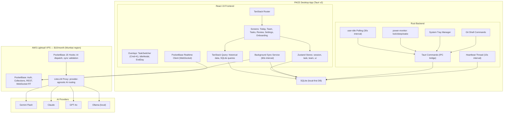
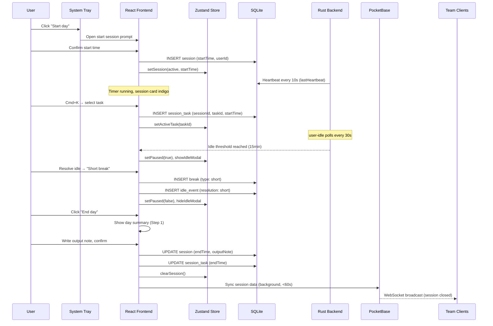
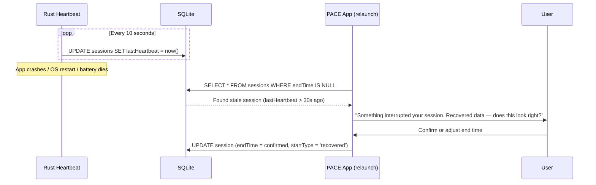
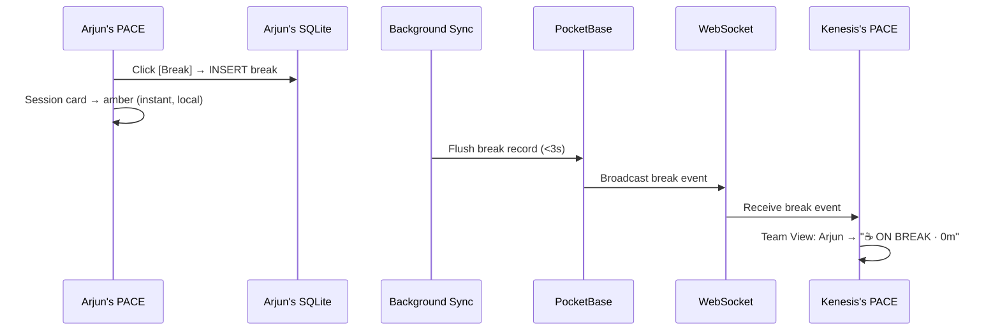
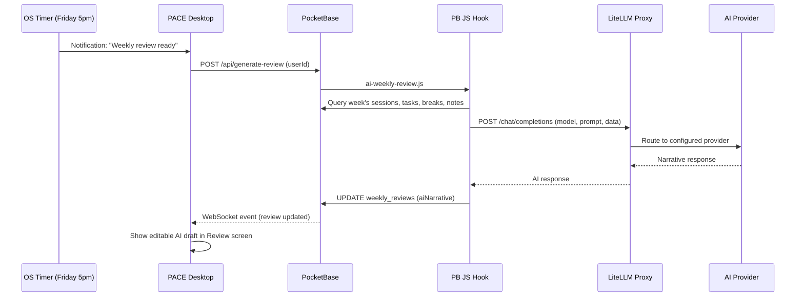

# Design Document: PACE Work Tracker

## Overview

PACE is a desktop-first work tracking application for Kenesis Labs, built as a Tauri v2 app with a React 19 + TypeScript frontend and Rust backend. It implements an honest daily work loop — login, set task, work, break, resume, log output, logout — with system-level idle detection, full team transparency via realtime WebSockets, and an AI reflection layer powered by LiteLLM.

The architecture follows an offline-first pattern: all data writes hit a local SQLite database immediately, the UI updates from local state, and a background sync service flushes changes to PocketBase (cloud) every 60 seconds. Team visibility is powered by PocketBase's realtime WebSocket subscriptions. The Rust layer handles all system-level concerns — idle detection via the `user-idle` crate, power monitor hooks, session heartbeat (10s interval), system tray management, and git shell commands. The React layer handles UI rendering, state management (Zustand for live state, TanStack Query for historical data), and routing (TanStack Router).

The app serves a 3–5 person team with full mutual transparency: every session, task, timer, break, and output note is visible to all members in real time. AI features (weekly review drafts, anomaly detection, standup generation, NL task creation, effort estimation, team health) operate only on completed session data, never interrupt live work, and route through PocketBase JS hooks to a LiteLLM proxy — API keys never touch the desktop client.

## Architecture



## Sequence Diagrams

### Session Lifecycle (Start → Work → Break → End)



### Crash Recovery Flow



### Realtime Team View



### AI Weekly Review Generation



## Components and Interfaces

### Component 1: Session Manager (Rust)

**Purpose**: Manages the session lifecycle — start, heartbeat, pause, resume, close, crash recovery. The heartbeat thread is the crash recovery backbone.

```typescript
// Tauri commands exposed to frontend via IPC
interface SessionCommands {
  start_session(userId: string, startTime: number, startType: 'manual' | 'backfill'): Promise<Session>
  end_session(sessionId: string, endTime: number, outputNote: string): Promise<void>
  get_active_session(userId: string): Promise<Session | null>
  recover_stale_session(sessionId: string, confirmedEndTime: number): Promise<void>
}
```

```rust
// Rust heartbeat thread
pub fn spawn_heartbeat(session_id: String, db_path: String) -> JoinHandle<()> {
    std::thread::spawn(move || {
        loop {
            let now = SystemTime::now()
                .duration_since(UNIX_EPOCH)
                .unwrap()
                .as_secs() as i64;
            // UPDATE sessions SET lastHeartbeat = ? WHERE id = ?
            write_heartbeat(&db_path, &session_id, now);
            std::thread::sleep(Duration::from_secs(10));
        }
    })
}
```

**Responsibilities**:
- Write heartbeat to SQLite every 10 seconds (sacred — never skip)
- Detect stale sessions on app launch (lastHeartbeat > 30s ago with no endTime)
- Provide recovery prompt data to frontend
- Manage session state transitions

### Component 2: Idle Detector (Rust)

**Purpose**: Polls system idle time via `user-idle` crate, emits events to frontend when thresholds are crossed. Handles micro-break absorption, idle threshold, and soft nudge timing.

```rust
// Rust idle detection loop
use user_idle::UserIdle;

pub struct IdleConfig {
    pub micro_break_threshold_secs: u64,    // 480 (8 min)
    pub idle_threshold_secs: u64,           // 900 (15 min, configurable 5-60)
    pub nudge_interval_secs: u64,           // 5400 (90 min, configurable 30-180)
    pub poll_interval_secs: u64,            // 30
}

pub enum IdleEvent {
    MicroPause { start: i64, duration_secs: u64 },
    IdleThresholdReached { idle_since: i64 },
    UserReturned { away_duration_secs: u64, away_since: i64 },
    SoftNudge { active_duration_secs: u64, current_task: String },
}
```

```typescript
// Frontend listener for idle events from Rust
interface IdleEventPayload {
  type: 'micro_pause' | 'idle_threshold' | 'user_returned' | 'soft_nudge'
  idleSince?: number        // Unix timestamp
  awayDuration?: number     // seconds
  activeDuration?: number   // seconds
  currentTask?: string
}

// listen('idle-event', (event: IdleEventPayload) => { ... })
```

**Responsibilities**:
- Poll `UserIdle::get_time()` every 30 seconds
- Absorb micro-breaks under 8 minutes silently
- Emit `idle_threshold` event when configurable threshold reached
- Track continuous active time for soft nudge (90-min default)
- Emit `user_returned` event with away duration for idle modal

### Component 3: Sync Service (Frontend)

**Purpose**: Background service that flushes local SQLite changes to PocketBase every 60 seconds. Handles offline queue, retry logic, and conflict resolution.

```typescript
interface SyncService {
  start(): void
  stop(): void
  forceSync(): Promise<SyncResult>
  getQueueSize(): number
  getLastSyncTime(): number | null
  isOnline(): boolean
}

interface SyncOperation {
  id: string
  collection: string
  operation: 'create' | 'update' | 'delete'
  recordId: string
  data: Record<string, unknown>
  timestamp: number
  retryCount: number
}

interface SyncResult {
  synced: number
  failed: number
  queued: number
}
```

**Responsibilities**:
- Queue all local writes as sync operations
- Flush queue to PocketBase every 60 seconds
- Persist queue across app restarts (SQLite-backed)
- Retry failed operations with exponential backoff
- Report sync status to UI (synced / offline / error)

### Component 4: Realtime Manager (Frontend)

**Purpose**: Manages PocketBase WebSocket subscriptions for live team view. Subscribes to active sessions, session_tasks, and breaks.

```typescript
interface RealtimeManager {
  connect(): Promise<void>
  disconnect(): void
  subscribeTeamUpdates(onUpdate: (event: TeamEvent) => void): () => void
  isConnected(): boolean
}

interface TeamEvent {
  type: 'session_update' | 'task_update' | 'break_update'
  userId: string
  record: Session | SessionTask | Break
  action: 'create' | 'update' | 'delete'
}

// PocketBase subscriptions
// subscribe('sessions', { filter: 'endTime = null' })
// subscribe('session_tasks', { filter: 'endTime = null' })
// subscribe('breaks', { filter: 'endTime = null' })
```

**Responsibilities**:
- Maintain WebSocket connection to PocketBase
- Subscribe to active sessions, tasks, and breaks for team view
- Update Zustand teamStore on incoming events
- Handle reconnection on network recovery

### Component 5: AI Dispatcher (PocketBase JS Hooks)

**Purpose**: Server-side AI feature routing. All AI calls go through PocketBase hooks to LiteLLM proxy — API keys never in desktop client.

```typescript
// PocketBase JS Hook endpoints
interface AIEndpoints {
  'POST /api/generate-review': (userId: string, weekStart: number) => Promise<{ narrative: string }>
  'POST /api/generate-standup': (userId: string) => Promise<{ standup: string }>
  'POST /api/estimate-task': (taskTitle: string, projectId: string) => Promise<{ minMinutes: number, maxMinutes: number, reasoning: string }>
  'POST /api/parse-task': (text: string, projects: Project[], team: User[]) => Promise<ParsedTask>
  'POST /api/team-health': (weekStart: number) => Promise<HealthSignal[]>
  'POST /api/detect-anomalies': (userId: string, weeks: number) => Promise<Anomaly[]>
}

interface ParsedTask {
  title: string
  projectId: string | null
  assigneeId: string | null
  priority: 'high' | 'medium' | 'low'
  dueDate: string | null  // YYYY-MM-DD
}

interface Anomaly {
  type: 'weekend_work' | 'task_avoidance' | 'high_output_window' | 'stale_project' | 'workload_imbalance'
  message: string
  severity: 'info' | 'warning' | 'alert'
}

interface HealthSignal {
  type: string
  message: string
  severity: 'info' | 'warning' | 'alert'
  affectedUsers?: string[]
}
```

**Responsibilities**:
- Route AI requests to LiteLLM proxy with user's configured model
- Build structured prompts from week/session data
- Store AI outputs in PocketBase collections
- Never expose API keys to desktop client
- All AI operates on completed data only — never during live sessions

## Data Models

### Session

```typescript
interface Session {
  id: string                                          // UUID
  userId: string                                      // FK → users
  startTime: number                                   // Unix timestamp (UTC)
  endTime: number | null                              // null while active
  startType: 'manual' | 'backfill' | 'recovered'
  startVerified: boolean                              // false if backfill before device wake
  outputNote: string | null
  lastHeartbeat: number | null                        // Updated every 10s by Rust
  syncedAt: number | null
  createdAt: number                                   // Unix timestamp (UTC)
}
```

**Validation Rules**:
- `startTime` must be within 4 hours of current time for backfill
- `endTime` must be >= `startTime` when set
- `lastHeartbeat` must be within 30s of current time for active sessions
- Only one session per user can have `endTime = null` at any time

### SessionTask

```typescript
interface SessionTask {
  id: string                                          // UUID
  sessionId: string                                   // FK → sessions
  taskId: string                                      // FK → tasks
  startTime: number                                   // Unix timestamp (UTC)
  endTime: number | null                              // null while active
  // minutes is computed: (endTime - startTime) / 60
}
```

**Validation Rules**:
- `startTime` must be >= parent session's `startTime`
- `endTime` must be <= parent session's `endTime` (when both set)
- Only one session_task per session can have `endTime = null`
- On task switch: close current session_task, open new one

### Break

```typescript
interface Break {
  id: string
  sessionId: string                                   // FK → sessions
  startTime: number                                   // Unix timestamp (UTC)
  endTime: number | null
  type: 'lunch' | 'short' | 'meeting' | 'discarded'
  autoDetected: boolean                               // true if from idle detection
}
```

**Validation Rules**:
- Break `startTime` must fall within parent session's time range
- Breaks under 8 minutes are micro-breaks — not surfaced in UI
- Break overflow: 90 minutes → nudge; 105 minutes → auto-close session
- `discarded` type removes gap from session time calculation

### IdleEvent

```typescript
interface IdleEvent {
  id: string
  sessionId: string
  startTime: number
  endTime: number | null
  resolution: 'lunch' | 'short' | 'meeting' | 'discarded' | 'pending'
}
```

### Task

```typescript
interface Task {
  id: string
  projectId: string                                   // FK → projects
  title: string
  status: 'open' | 'inprogress' | 'done' | 'blocked'
  assigneeId: string | null                           // FK → users
  priority: 'high' | 'medium' | 'low'
  dueDate: number | null                              // Unix timestamp
  estimatedMinutes: number | null                     // AI-suggested or manual
  notes: string | null
  createdBy: string                                   // FK → users
  createdAt: number
  closedAt: number | null
}
```

**Validation Rules**:
- `title` is required, non-empty
- `projectId` must reference an active (non-archived) project
- `status` transitions: open → inprogress → done | blocked; blocked → open | inprogress
- Tasks with no logged time in 7+ days flagged as stale (blocked excluded)

### Project

```typescript
interface Project {
  id: string
  name: string
  color: string                                       // Hex, auto-assigned from palette
  createdBy: string
  createdAt: number
  archivedAt: number | null                           // null if active
}
```

### User

```typescript
interface User {
  id: string
  name: string
  role: string | null
  email: string
  avatarColor: string                                 // Default: #6e6af6
  createdAt: number
}
```

### Settings

```typescript
interface Settings {
  userId: string                                      // PK, FK → users
  theme: 'light' | 'dark' | 'system'
  idleThresholdMin: number                            // 5–60, default 15
  nudgeIntervalMin: number                            // 30–180, default 90
  breakCapMin: number                                 // 30–180, default 90
  weeklyReviewDay: number                             // 0–6, default 5 (Friday)
  weeklyReviewHour: number                            // 0–23, default 17
  autoPauseOnLock: boolean
  autoPauseOnSleep: boolean
  litellmUrl: string | null
  litellmModel: string                                // default: 'gemini/gemini-2.0-flash'
  litellmApiKey: string | null
  aiEnabled: boolean
  gitRepoPaths: string[]                              // Local filesystem paths
}
```

### WeeklyReview

```typescript
interface WeeklyReview {
  id: string
  userId: string
  weekStart: number                                   // Monday 00:00 UTC
  weekEnd: number                                     // Sunday 23:59 UTC
  aiNarrative: string | null
  nextPriority: string | null
  savedAt: number | null
  createdAt: number
}
```

### GitEvent

```typescript
interface GitEvent {
  id: string
  sessionId: string | null
  userId: string
  repoPath: string
  commitHash: string
  message: string | null
  commitTime: number
}
```


## Algorithmic Pseudocode

### Session Start Algorithm

```typescript
async function startSession(userId: string, claimedStartTime: number): Promise<Session> {
  // Preconditions:
  //   userId exists in users table
  //   claimedStartTime <= now()
  //   claimedStartTime >= now() - 4 hours
  //   No active session exists for userId (endTime = null)

  const now = Date.now() / 1000
  const deviceWakeTime = await invoke<number>('get_device_wake_time')
  
  // Determine start type and verification
  let startType: 'manual' | 'backfill' = 'manual'
  let startVerified = true
  
  if (claimedStartTime < now - 60) {
    startType = 'backfill'
  }
  if (claimedStartTime < deviceWakeTime) {
    startVerified = false  // Flagged as unverifiable in admin view
  }

  const session: Session = {
    id: crypto.randomUUID(),
    userId,
    startTime: claimedStartTime,
    endTime: null,
    startType,
    startVerified,
    outputNote: null,
    lastHeartbeat: now,
    syncedAt: null,
    createdAt: now,
  }

  // Write to SQLite immediately (offline-first)
  await db.execute(
    `INSERT INTO sessions (id, userId, startTime, startType, startVerified, lastHeartbeat, createdAt)
     VALUES (?, ?, ?, ?, ?, ?, ?)`,
    [session.id, session.userId, session.startTime, session.startType,
     session.startVerified ? 1 : 0, session.lastHeartbeat, session.createdAt]
  )

  // Start Rust heartbeat thread
  await invoke('start_heartbeat', { sessionId: session.id })

  // Start Rust idle detection
  await invoke('start_idle_detection', { sessionId: session.id })

  // Update Zustand store → UI reacts immediately
  sessionStore.getState().setSession(session)

  // Queue for PocketBase sync
  syncService.queue('create', 'sessions', session)

  // Postconditions:
  //   Session record exists in SQLite with endTime = null
  //   Heartbeat thread is running (10s interval)
  //   Idle detection is polling (30s interval)
  //   Zustand store reflects active session
  //   Sync queue contains pending operation

  return session
}
```

**Preconditions:**
- `userId` references a valid user in the local database
- `claimedStartTime` is a Unix timestamp ≤ current time and ≥ (current time - 4 hours)
- No session with `endTime = null` exists for this user

**Postconditions:**
- A new session record exists in SQLite with `endTime = null`
- Rust heartbeat thread is writing `lastHeartbeat` every 10 seconds
- Rust idle detection is polling every 30 seconds
- Zustand session store is updated
- Sync operation is queued for PocketBase

**Loop Invariants:** N/A (no loops)

### Idle Detection Algorithm (Rust)

```rust
fn idle_detection_loop(config: IdleConfig, session_id: String, app_handle: AppHandle) {
    // Preconditions:
    //   config.idle_threshold_secs is in range [300, 3600] (5-60 min)
    //   config.poll_interval_secs == 30
    //   session_id references an active session
    //   config.nudge_interval_secs is in range [1800, 10800] (30-180 min)

    let mut continuous_active_secs: u64 = 0;
    let mut was_idle = false;
    let mut idle_start: Option<i64> = None;

    loop {
        // Loop invariant: continuous_active_secs tracks unbroken active time
        // Loop invariant: was_idle reflects previous iteration's idle state
        // Loop invariant: idle_start is Some(timestamp) iff currently idle

        std::thread::sleep(Duration::from_secs(config.poll_interval_secs));

        let idle_secs = UserIdle::get_time().unwrap().as_seconds();
        let now = unix_now();

        if idle_secs >= config.idle_threshold_secs && !was_idle {
            // Transition: active → idle
            idle_start = Some(now - idle_secs as i64);
            was_idle = true;
            continuous_active_secs = 0;

            app_handle.emit("idle-event", IdleEvent::IdleThresholdReached {
                idle_since: idle_start.unwrap(),
            });

        } else if idle_secs < config.micro_break_threshold_secs && was_idle {
            // Transition: idle → returned
            let away_duration = idle_start.map(|s| (now - s) as u64).unwrap_or(0);

            if away_duration >= config.micro_break_threshold_secs
               && away_duration < 20 * 60 {
                // 8-20 min: micro-pause, noted in timeline, no prompt
                app_handle.emit("idle-event", IdleEvent::MicroPause {
                    start: idle_start.unwrap(),
                    duration_secs: away_duration,
                });
            } else if away_duration >= 20 * 60 {
                // 20+ min: prompt user on return
                app_handle.emit("idle-event", IdleEvent::UserReturned {
                    away_duration_secs: away_duration,
                    away_since: idle_start.unwrap(),
                });
            }
            // Under 8 min: absorbed silently, no event

            was_idle = false;
            idle_start = None;
            continuous_active_secs = 0;

        } else if idle_secs < config.poll_interval_secs && !was_idle {
            // User is actively working
            continuous_active_secs += config.poll_interval_secs;

            if continuous_active_secs >= config.nudge_interval_secs {
                app_handle.emit("idle-event", IdleEvent::SoftNudge {
                    active_duration_secs: continuous_active_secs,
                    current_task: get_current_task(&session_id),
                });
                continuous_active_secs = 0; // Reset after nudge
            }
        }
    }

    // Postconditions:
    //   Loop runs until session ends or app terminates
    //   All idle transitions emit appropriate events to frontend
    //   Micro-breaks under 8 min are silently absorbed
}
```

**Preconditions:**
- Valid `IdleConfig` with thresholds in allowed ranges
- Active session exists in SQLite
- `user-idle` crate is available on the platform (IOKit/GetLastInputInfo/X11)

**Postconditions:**
- Idle events are emitted to the React frontend via Tauri event system
- Micro-breaks under 8 minutes produce no user-visible event
- Soft nudge fires after configurable continuous active time

**Loop Invariants:**
- `continuous_active_secs` accurately reflects unbroken active time since last idle or nudge
- `was_idle` is true if and only if the user is currently past the idle threshold
- `idle_start` is `Some(timestamp)` if and only if `was_idle` is true

### Task Switch Algorithm

```typescript
async function switchTask(sessionId: string, newTaskId: string): Promise<void> {
  // Preconditions:
  //   sessionId references an active session (endTime = null)
  //   newTaskId references an existing task with status != 'done'
  //   newTaskId != current active task (no self-switch)

  const now = Math.floor(Date.now() / 1000)

  // Close current session_task
  const currentSessionTask = await db.select<SessionTask[]>(
    `SELECT * FROM session_tasks WHERE sessionId = ? AND endTime IS NULL`,
    [sessionId]
  )

  if (currentSessionTask.length > 0) {
    await db.execute(
      `UPDATE session_tasks SET endTime = ? WHERE id = ?`,
      [now, currentSessionTask[0].id]
    )
    syncService.queue('update', 'session_tasks', {
      id: currentSessionTask[0].id, endTime: now
    })
  }

  // Open new session_task
  const newSessionTask: SessionTask = {
    id: crypto.randomUUID(),
    sessionId,
    taskId: newTaskId,
    startTime: now,
    endTime: null,
  }

  await db.execute(
    `INSERT INTO session_tasks (id, sessionId, taskId, startTime) VALUES (?, ?, ?, ?)`,
    [newSessionTask.id, newSessionTask.sessionId, newSessionTask.taskId, newSessionTask.startTime]
  )

  // Update task status to inprogress
  await db.execute(
    `UPDATE tasks SET status = 'inprogress' WHERE id = ? AND status = 'open'`,
    [newTaskId]
  )

  // Update Zustand
  taskStore.getState().setActiveTask(newTaskId)

  // Queue syncs
  syncService.queue('create', 'session_tasks', newSessionTask)

  // Postconditions:
  //   Previous session_task has endTime set
  //   New session_task exists with endTime = null
  //   Only one session_task per session has endTime = null
  //   Task status updated to 'inprogress' if was 'open'
  //   Zustand reflects new active task
}
```

**Preconditions:**
- Active session exists (endTime = null)
- Target task exists and is not in 'done' status
- Target task is different from current active task

**Postconditions:**
- Previous session_task is closed with endTime = current timestamp
- New session_task is created with endTime = null
- Exactly one session_task per session has endTime = null (invariant maintained)
- Task status transitions from 'open' to 'inprogress' if applicable

**Loop Invariants:** N/A

### Background Sync Algorithm

```typescript
async function syncLoop(): Promise<void> {
  // Preconditions:
  //   SQLite sync queue table exists
  //   PocketBase URL and auth are configured

  const SYNC_INTERVAL_MS = 60_000
  const MAX_RETRIES = 5

  while (true) {
    // Loop invariant: queue contains all unsynced operations ordered by timestamp
    // Loop invariant: each operation's retryCount < MAX_RETRIES or it's been discarded

    await sleep(SYNC_INTERVAL_MS)

    if (!navigator.onLine) {
      continue  // Queue persists, retry on reconnect
    }

    const queue = await db.select<SyncOperation[]>(
      `SELECT * FROM sync_queue ORDER BY timestamp ASC LIMIT 50`
    )

    for (const op of queue) {
      try {
        switch (op.operation) {
          case 'create':
            await pb.collection(op.collection).create(op.data)
            break
          case 'update':
            await pb.collection(op.collection).update(op.recordId, op.data)
            break
          case 'delete':
            await pb.collection(op.collection).delete(op.recordId)
            break
        }
        // Success: remove from queue
        await db.execute(`DELETE FROM sync_queue WHERE id = ?`, [op.id])

      } catch (error) {
        op.retryCount++
        if (op.retryCount >= MAX_RETRIES) {
          // Move to dead letter queue for manual review
          await db.execute(`DELETE FROM sync_queue WHERE id = ?`, [op.id])
          await db.execute(
            `INSERT INTO sync_dead_letter (id, collection, operation, data, error, timestamp)
             VALUES (?, ?, ?, ?, ?, ?)`,
            [op.id, op.collection, op.operation, JSON.stringify(op.data), String(error), Date.now()]
          )
        } else {
          await db.execute(
            `UPDATE sync_queue SET retryCount = ? WHERE id = ?`,
            [op.retryCount, op.id]
          )
        }
      }
    }

    // Update last sync timestamp
    uiStore.getState().setLastSyncTime(Date.now())
  }

  // Postconditions:
  //   All successfully synced operations removed from queue
  //   Failed operations retried up to MAX_RETRIES
  //   Exhausted operations moved to dead letter queue
  //   UI reflects latest sync timestamp
}
```

**Preconditions:**
- Sync queue table exists in SQLite
- PocketBase client is initialized with valid URL

**Postconditions:**
- Successfully synced operations are removed from queue
- Failed operations are retried with exponential backoff up to MAX_RETRIES
- Exhausted operations are moved to dead letter queue
- UI sync status indicator is updated

**Loop Invariants:**
- Queue contains only unsynced operations ordered by timestamp
- Each operation's retryCount is less than MAX_RETRIES (or it's been moved to dead letter)
- No data is lost — operations persist in queue or dead letter

### Crash Recovery Algorithm

```typescript
async function checkCrashRecovery(userId: string): Promise<RecoveryResult | null> {
  // Preconditions:
  //   App just launched
  //   userId is the authenticated user

  const staleSessions = await db.select<Session[]>(
    `SELECT * FROM sessions WHERE userId = ? AND endTime IS NULL`,
    [userId]
  )

  if (staleSessions.length === 0) {
    return null  // No recovery needed
  }

  const session = staleSessions[0]
  const now = Math.floor(Date.now() / 1000)
  const heartbeatAge = now - (session.lastHeartbeat ?? 0)

  if (heartbeatAge <= 30) {
    // Session is still fresh — resume normally
    return { type: 'resume', session }
  }

  // Stale session detected — gather recovery data
  const sessionTasks = await db.select<SessionTask[]>(
    `SELECT st.*, t.title FROM session_tasks st
     JOIN tasks t ON st.taskId = t.id
     WHERE st.sessionId = ?`,
    [session.id]
  )

  const breaks = await db.select<Break[]>(
    `SELECT * FROM breaks WHERE sessionId = ?`,
    [session.id]
  )

  // Postconditions:
  //   Returns recovery data for UI prompt
  //   User will confirm or adjust end time
  //   Session will be closed with startType = 'recovered'

  return {
    type: 'recovery_needed',
    session,
    lastHeartbeat: session.lastHeartbeat,
    tasks: sessionTasks,
    breaks,
    suggestedEndTime: session.lastHeartbeat,  // Best guess
  }
}
```

**Preconditions:**
- App has just launched (fresh start or relaunch after crash)
- User is authenticated

**Postconditions:**
- Returns null if no stale sessions exist
- Returns `resume` if session heartbeat is fresh (≤30s)
- Returns `recovery_needed` with full session context for user confirmation
- No data is modified — user must confirm before session is closed

## Key Functions with Formal Specifications

### endSession()

```typescript
async function endSession(
  sessionId: string,
  endTime: number,
  outputNote: string
): Promise<void>
```

**Preconditions:**
- `sessionId` references a session with `endTime = null`
- `endTime` >= session's `startTime`
- `outputNote` is a non-empty string (minimum 1 character encouraged)

**Postconditions:**
- Session record updated: `endTime` set, `outputNote` stored
- All open session_tasks closed with `endTime`
- All open breaks closed with `endTime`
- Heartbeat thread stopped
- Idle detection stopped
- Zustand session store cleared
- Sync operations queued for all modified records
- Git events collected for session time range (if repos configured)

### resolveIdleEvent()

```typescript
async function resolveIdleEvent(
  idleEventId: string,
  resolution: 'lunch' | 'short' | 'meeting' | 'discarded'
): Promise<void>
```

**Preconditions:**
- `idleEventId` references an idle_event with `resolution = 'pending'`
- Session is active (endTime = null)

**Postconditions:**
- Idle event updated with chosen resolution
- If resolution != 'discarded': break record created with matching type and time range
- If resolution == 'discarded': gap removed from session time (no break record)
- Session timer resumes from current time
- Idle modal dismissed
- Zustand idle state cleared

### collectGitEvents()

```typescript
async function collectGitEvents(
  sessionId: string,
  userId: string,
  sessionStart: number,
  sessionEnd: number
): Promise<GitEvent[]>
```

**Preconditions:**
- `sessionId` references a closed session
- `sessionStart` < `sessionEnd`
- User has configured git repo paths in settings

**Postconditions:**
- Returns array of GitEvent records for commits within session time range
- Each GitEvent contains commitHash, message, commitTime, repoPath
- Events stored in SQLite git_events table
- Empty array if no repos configured or no commits found
- Shell command executed via `tauri-plugin-shell` (cross-platform)

### generateWeeklyReview()

```typescript
async function generateWeeklyReview(
  userId: string,
  weekStart: number
): Promise<WeeklyReview>
```

**Preconditions:**
- `userId` references a valid user
- `weekStart` is a Monday 00:00 UTC timestamp
- AI is enabled in user settings
- LiteLLM URL and API key are configured

**Postconditions:**
- WeeklyReview record created/updated with `aiNarrative`
- AI request routed through PocketBase → LiteLLM (keys never in client)
- Narrative contains: top project, tasks closed, gaps, pattern observation, suggested priority
- No productivity scores or member comparisons in output
- Review is editable by user (draft, not final)

## Example Usage

```typescript
// === Session Lifecycle ===

// 1. Start day
const session = await startSession(currentUser.id, Math.floor(Date.now() / 1000))
// Session card appears: indigo, timer running from 0:00:00

// 2. Set first task via Cmd+K
await switchTask(session.id, 'task-hero-section-build')
// Task switcher closes, "Hero section build" shown in session card

// 3. Work for 2 hours... idle detection handles gaps automatically
// Rust polls every 30s, heartbeat writes every 10s

// 4. User returns after 24 min away
// Idle modal appears: "You stepped away — Away for 24 min"
await resolveIdleEvent(idleEvent.id, 'meeting')
// Break logged, timer resumes

// 5. Switch task
await switchTask(session.id, 'task-mj-assets')
// Previous task time logged, new task timer starts

// 6. End day
await endSession(session.id, Math.floor(Date.now() / 1000), 'Hero section built. MJ prompts done for 3 scenes.')
// Day summary shown, goodbye screen, session closed

// === Team View (realtime) ===

// On Kenesis's machine:
realtimeManager.subscribeTeamUpdates((event) => {
  if (event.type === 'break_update' && event.userId === 'arjun') {
    // Arjun's card → "☕ ON BREAK · 0m"
    teamStore.getState().updateMember('arjun', { status: 'break', breakStart: event.record.startTime })
  }
})

// === Crash Recovery ===

// App relaunches after crash
const recovery = await checkCrashRecovery(currentUser.id)
if (recovery?.type === 'recovery_needed') {
  // Show: "Something interrupted your session. Last heartbeat: 2:14pm"
  // User confirms end time → session closed with startType = 'recovered'
  await invoke('recover_stale_session', {
    sessionId: recovery.session.id,
    confirmedEndTime: userConfirmedTime,
  })
}

// === AI Weekly Review ===

// Friday 5pm — triggered by OS timer
const review = await generateWeeklyReview(currentUser.id, mondayTimestamp)
// Review screen shows editable AI narrative:
// "This week you invested 28 hours across 4 projects..."
```

## Correctness Properties

*A property is a characteristic or behavior that should hold true across all valid executions of a system — essentially, a formal statement about what the system should do. Properties serve as the bridge between human-readable specifications and machine-verifiable correctness guarantees.*

### Property 1: Single Active Session Invariant

*For any* user and any sequence of session start/stop operations, at most one session for that user has `endTime = null` at any point in time. Attempting to start a second concurrent session is rejected and the existing session is preserved.

**Validates: Requirements 1.6, 20.1**

### Property 2: Session Start Classification

*For any* claimed start time provided during session creation, if the claimed time is earlier than the current time but within 4 hours then `startType` is "backfill", and if the claimed time is earlier than the device wake time then `startVerified` is false. These classifications are mutually independent and both may apply simultaneously.

**Validates: Requirements 1.2, 1.3**

### Property 3: Crash Recovery Classification

*For any* app launch where a session exists with `endTime = null`, if `lastHeartbeat` is older than 30 seconds the system classifies it as recovery-needed, and if `lastHeartbeat` is within 30 seconds the system resumes normally. The classification is determined solely by heartbeat age.

**Validates: Requirements 2.2, 2.4**

### Property 4: Session End Closes All Children

*For any* active session with open session_tasks and open breaks, when the session is ended, all child session_tasks and breaks have their `endTime` set to the session's end time. No child record remains with `endTime = null` after the parent session is closed.

**Validates: Requirements 3.2, 3.3**

### Property 5: Idle Duration Classification

*For any* idle period detected during an active session, exactly one classification applies: (a) under 8 minutes — silently absorbed, no event emitted, no record created; (b) 8 to under 20 minutes — recorded as micro-pause in timeline, no user prompt; (c) 20 or more minutes — user prompted via Idle_Modal on return. Additionally, when continuous active time reaches the configured nudge interval, a soft nudge event fires and the nudge timer resets.

**Validates: Requirements 5.2, 5.3, 5.6, 5.7, 6.1**

### Property 6: Idle Resolution Creates Correct Records

*For any* idle event resolved by the user, if the resolution is "lunch," "short," or "meeting," a break record is created with the matching type and the idle period's time range. If the resolution is "discard," no break record is created and the gap is excluded from session time. Exactly one of these two outcomes occurs per resolution.

**Validates: Requirements 5.4, 5.5**

### Property 7: Task Switch Maintains Single Active Task

*For any* sequence of task switches within a session, after each switch exactly one session_task has `endTime = null`. The previous session_task's `endTime` is set to the switch timestamp, and a new session_task is created with `startTime` equal to the same timestamp. If the target task had status "open," its status transitions to "inprogress."

**Validates: Requirements 9.2, 9.3, 20.2**

### Property 8: Temporal Containment

*For any* session_task or break belonging to a session, the child's `startTime` is greater than or equal to the parent session's `startTime`, and the child's `endTime` (when set) is less than or equal to the parent session's `endTime`. Additionally, for any closed session, `endTime` is greater than or equal to `startTime`.

**Validates: Requirements 20.3, 20.4, 20.6**

### Property 9: Sync Queue Durability and Ordering

*For any* set of data mutations queued for sync, the sync queue persists in SQLite across app restarts, operations are flushed to PocketBase in timestamp order, and no operation is lost — it either syncs successfully and is removed, or after 5 failed retries it is moved to the dead letter queue.

**Validates: Requirements 13.2, 13.3, 13.4, 13.5**

### Property 10: Offline-First Write Ordering

*For any* data mutation in the system, the SQLite write completes before any corresponding network call is initiated. The local database is always the source of truth for the current state.

**Validates: Requirement 13.1**

### Property 11: Sync Batch Size Limit

*For any* sync cycle, the Sync_Service processes at most 50 operations, selected in timestamp order from the queue. Remaining operations stay queued for subsequent cycles.

**Validates: Requirement 14.3**

### Property 12: Team Status Label Correctness

*For any* team member displayed in the Team view, the status label is exactly one of "Active," "On Break," "Away," or "Offline." When a team member is idle, the label contains "Away" and never contains "Idle" or surveillance-related language.

**Validates: Requirements 15.3, 15.4**

### Property 13: UTC Timestamp Consistency

*For all* timestamps stored in SQLite, the value is a Unix timestamp in UTC (seconds since epoch). Local timezone conversion occurs only in the display/rendering layer, never in storage or business logic.

**Validates: Requirement 20.5**

### Property 14: API Key Isolation

*For all* AI requests originating from the PACE desktop client, the request payload contains no API keys or provider credentials. All key resolution happens server-side in PocketBase JS hooks before forwarding to LiteLLM.

**Validates: Requirement 17.2**

### Property 15: AI Operates on Completed Data Only

*For all* data passed to the AI_Dispatcher, every session in the input has a non-null `endTime`. No active session data is included in any AI request payload.

**Validates: Requirement 17.1**

### Property 16: Task Validation and Stale Detection

*For any* task, the status field accepts only the values "open," "inprogress," "done," or "blocked." For any task with no logged session time in 7 or more days and status not equal to "blocked," the task is flagged as stale in the weekly review.

**Validates: Requirements 8.4, 8.5**

### Property 17: Weekly Review Aggregation Correctness

*For any* week of session data, the weekly review aggregation produces: total hours equal to the sum of all session durations minus break/discard time, tasks closed count equal to the number of tasks with `closedAt` within the week, and per-project time equal to the sum of session_task durations grouped by project. The team tab displays hours, tasks, and active days per member without any ranking or scoring.

**Validates: Requirements 16.2, 16.6**

### Property 18: Output Note Pre-fill Round Trip

*For any* output note text written during an active session, when the user initiates "End day," the end-of-day form is pre-filled with that same text. After session close, querying the session record returns the stored output note unchanged.

**Validates: Requirements 12.2, 12.3**

### Property 19: Settings Persistence Round Trip

*For any* settings change made by the user, writing the new value to SQLite and then reading it back produces the original value. The updated setting takes effect immediately without app restart.

**Validates: Requirement 19.2**

### Property 20: Tray Icon State Mapping

*For any* application state, the system tray icon maps to exactly one visual state: gray when no active session, indigo pulse when session is active, amber when on break, red pulse when idle is detected, and muted when offline. The mapping is deterministic and total — every possible state maps to exactly one icon.

**Validates: Requirement 21.1**

### Property 21: Day Summary Computation

*For any* active session with associated session_tasks and breaks, the day summary computes: total time as the difference between current time and session start minus total break/discard duration, tasks closed as the count of tasks marked "done" during the session, and breaks taken as the count of non-micro break records. These computations are consistent with the underlying data.

**Validates: Requirement 3.1**

### Property 22: Break Visibility Filtering

*For any* break record with duration under 8 minutes, the break is excluded from all user-facing UI queries and displays. Only breaks of 8 minutes or longer appear in the session timeline and day summary.

**Validates: Requirement 7.6**

### Property 23: Git Event Session Linkage

*For any* set of git commits found within a session's time range across configured repos, each commit is stored as a git_event record linked to that session. The displayed information includes only the commit message and timestamp — no commit counts, scores, or diff data.

**Validates: Requirements 11.2, 11.3**

## Error Handling

### Error Scenario 1: App Crash During Active Session

**Condition**: PACE process terminates unexpectedly (crash, OS kill, power loss)
**Response**: On next launch, detect stale session via `lastHeartbeat` age > 30 seconds with `endTime = null`. Show recovery prompt with last known state.
**Recovery**: User confirms or adjusts end time. Session closed with `startType = 'recovered'`. Heartbeat thread ensures recovery point is within 10 seconds of actual last activity.

### Error Scenario 2: Network Offline During Sync

**Condition**: PocketBase unreachable during background sync cycle
**Response**: Sync operations remain in SQLite queue. App continues functioning fully from local data. UI shows "Offline" indicator.
**Recovery**: On network restoration, queue flushes automatically on next 60-second cycle. Operations applied in timestamp order. Retry with exponential backoff up to 5 attempts.

### Error Scenario 3: PocketBase WebSocket Disconnection

**Condition**: WebSocket connection to PocketBase drops (network change, server restart)
**Response**: Team view shows stale data with "Last updated X ago" indicator. Local user's session continues unaffected.
**Recovery**: Realtime manager auto-reconnects with exponential backoff. On reconnect, full state refresh from PocketBase to catch missed events.

### Error Scenario 4: SQLite Write Failure

**Condition**: Local SQLite write fails (disk full, corruption, permission error)
**Response**: Error surfaced via Sonner toast: "Failed to save — check disk space." Session state held in Zustand memory as fallback.
**Recovery**: Retry write on next heartbeat cycle. If persistent, prompt user to export data and clear local cache from Settings.

### Error Scenario 5: AI Provider Failure

**Condition**: LiteLLM proxy returns error (provider down, rate limit, invalid key)
**Response**: AI feature gracefully degrades — weekly review shows data without narrative. Toast: "AI unavailable — review data is still complete."
**Recovery**: User can retry via "Regenerate" button. Settings screen shows "Test connection" for diagnostics. All non-AI features continue normally.

### Error Scenario 6: Concurrent Session Conflict

**Condition**: User starts session on Machine A, then opens PACE on Machine B
**Response**: Machine B detects active session via PocketBase sync. Shows: "You have an active session on another device."
**Recovery**: User can either continue on current device (close remote session) or switch to the other device. Session is tied to user account, not machine.

## Testing Strategy

### Unit Testing Approach

Focus on pure logic functions that don't require Tauri runtime:
- Session time calculations (total time, break deductions, task time accumulation)
- Idle threshold classification (micro-break vs prompt vs absorbed)
- Sync queue ordering and retry logic
- Data validation (session temporal ordering, single active session invariant)
- UTC timestamp conversion for display
- Weekly review data aggregation

### Property-Based Testing Approach

**Property Test Library**: fast-check (TypeScript)

Key properties to test:
- For any sequence of task switches within a session, total task time equals session active time (minus breaks)
- For any idle duration, exactly one classification applies: absorbed (<8min), micro-pause (8-20min), or prompted (20+min)
- For any sync queue state, operations maintain causal ordering after retry
- Session start/end times always satisfy temporal ordering constraints
- Break overflow logic correctly triggers at configured threshold

### Integration Testing Approach

- Tauri command round-trips: invoke Rust commands from test harness, verify SQLite state
- Sync cycle: mock PocketBase, verify queue drain and retry behavior
- Idle detection: mock `user-idle` crate responses, verify event emission sequence
- Crash recovery: simulate stale heartbeat, verify recovery prompt data
- WebSocket: mock PocketBase realtime, verify team store updates

## Performance Considerations

- **Heartbeat thread**: Rust thread with 10-second sleep — negligible CPU. SQLite write is <1ms.
- **Idle polling**: 30-second interval via `user-idle` — single syscall per poll (IOKit/GetLastInputInfo/X11). Negligible overhead.
- **Timer rendering**: JavaScript `setInterval` at 1-second granularity reading from Zustand start time. No re-renders of other components.
- **Sync queue**: Batched 50 operations per cycle. SQLite reads are indexed. PocketBase writes are sequential to maintain ordering.
- **Team view WebSocket**: 3 subscriptions (sessions, session_tasks, breaks) with server-side filtering. Only active records transmitted.
- **SQLite indexes**: On `sessions(userId, startTime)`, `session_tasks(sessionId)`, `tasks(projectId)`, `git_events(sessionId)`, `breaks(sessionId)` — covers all hot query paths.
- **Archive strategy**: Sessions older than 90 days archived to cloud-only, reducing local DB size.

## Security Considerations

- **API key isolation**: LiteLLM API keys stored in PocketBase server environment only. Desktop client never sees provider keys. PocketBase JS hooks make AI calls server-side.
- **Local data encryption**: SQLite database stored in Tauri's app data directory with OS-level file permissions. No additional encryption layer (internal tool, trusted devices).
- **Auth**: PocketBase email/password auth for team members. Session tokens stored securely via Tauri's credential storage.
- **No PII in AI prompts**: AI prompts contain task titles, hours, and output notes — no personal data beyond work context.
- **Git data**: Only commit messages and timestamps collected. No diffs, no file contents, no branch names beyond what `git log --format` provides.
- **Transport**: All PocketBase and LiteLLM communication over HTTPS. WebSocket connections use WSS.

## Dependencies

| Dependency | Layer | Purpose |
|------------|-------|---------|
| Tauri v2 | Desktop shell | Cross-platform app container |
| React 19 | Frontend | UI rendering |
| TypeScript 5.x | Frontend | Type safety |
| Vite | Build | Dev server + bundling |
| Tailwind CSS v4 | Frontend | Utility-first styling |
| shadcn/ui | Frontend | Accessible component primitives |
| Zustand | Frontend | Live state (session, task, team, UI) |
| TanStack Query v5 | Frontend | Historical data queries + caching |
| TanStack Router | Frontend | Type-safe file-based routing |
| Recharts | Frontend | Charts (weekly review, timeline) |
| Motion (Framer) | Frontend | Animations + transitions |
| Sonner | Frontend | Toast notifications |
| Lucide React | Frontend | Icon set |
| Geist + Geist Mono | Frontend | Typography |
| user-idle | Rust | System-level idle detection |
| tauri-plugin-sql | Rust | SQLite access |
| tauri-plugin-notification | Rust | OS notifications |
| tauri-plugin-shell | Rust | Git log shell commands |
| tauri-plugin-autostart | Rust | Launch on system startup |
| tauri-plugin-single-instance | Rust | Prevent duplicate windows |
| tauri-plugin-power-monitor | Rust | Screen lock/sleep/wake events |
| PocketBase | Backend | Auth, collections, REST API, WebSocket RT |
| LiteLLM | Backend | Provider-agnostic AI proxy |
