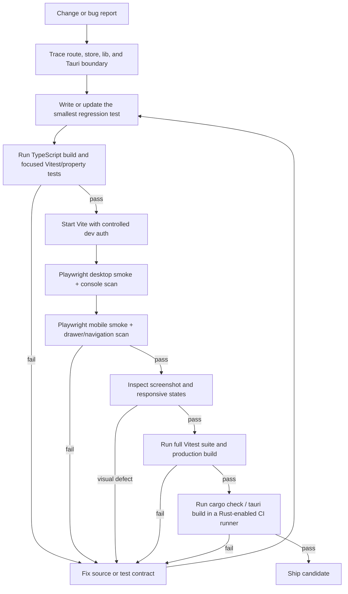

# PACE ship/debug loop

Use this loop for every release candidate. Stop only when the same commit passes the code, runtime, visual, and packaging gates.



## Local gates

```bash
npm ci --no-audit --no-fund
npm test
npm run build
npm run test:e2e
cargo check --manifest-path src-tauri/Cargo.toml
npm run tauri build
```

The E2E command is intentionally scoped to `e2e/**/*.spec.ts` by `playwright.config.ts`; it must not discover Vitest files under `src/`.

## Debug order

1. Reproduce the smallest failing state and capture the route, viewport, console output, and data shape.
2. Trace the state transition through the store/lib boundary before changing UI code.
3. Add a deterministic regression test. Time-based fixtures must be relative to the current UTC clock.
4. Run focused checks, then the full suite and production build.
5. Recheck the same flow in the authenticated desktop shell and at the narrowest supported viewport.
6. Treat console errors, clipped content, unreachable navigation, missing empty/loading/error states, and native build failures as ship blockers.
